# Decor Dreams


Welcome to [Decor Dreams](https://decor-dreams-ff212364915e.herokuapp.com/), your destination for all your home decor needs!

Discover our top-notch collection of furniture and decor items, from cozy sofas to elegant tables and chairs, along with outdoor essentials and beautiful decorations. Plus, take advantage of our expert team's insights by scheduling a consultation right here in Dublin, Ireland, and delve into the world of interior design with ease.

This is a fictional B2C e-commerce store created for educational purposes as part of the Portfolio of Code Institute.

## CONTENTS

- [Decor Dreams](#decor-dreams)
  - [CONTENTS](#contents)
  - [User Experience (UX)](#user-experience-ux)
    - [Target Audience](#target-audience)
    - [User Stories](#user-stories)
  - [Design](#design)
    - [Color Scheme](#color-scheme)
    - [Imagery](#imagery)
    - [Typography](#typography)
    - [Wireframes](#wireframes)
  - [Agile Methodology](#agile-methodology)
  - [Database Diagram](#database-diagram)
  - [Security Features and Defensive Design](#security-features-and-defensive-design)
    - [User Authentication](#user-authentication)
    - [Form Validation](#form-validation)
    - [Database Security](#database-security)
    - [Cross-Site Request Forgery (CSRF) Protection](#cross-site-request-forgery-csrf-protection)
    - [Custom Error Pages](#custom-error-pages)
  - [Features](#features)
    - [Favicon](#favicon)
    - [Header](#header)
    - [Mailchimp](#mailchimp)
    - [Footer](#footer)
    - [Home Page](#home-page)
    - [User Account Pages](#user-account-pages)
      - [Sign Up](#sign-up)
      - [Sign In](#sign-in)
      - [Sign Out](#sign-out)
    - [Profile](#profile)
    - [Shop Products](#shop-products)
    - [Product Details](#product-details)
    - [Products Management](#products-management)
      - [Add a Product](#add-a-product)
      - [Edit a Product](#edit-a-product)
      - [Delete a Product](#delete-a-product)
    - [Shopping Bag](#shopping-bag)
    - [Checkout](#checkout)
    - [Interior Design](#interior-design)
    - [Interior Design Management](#interior-design-management)
      - [Add a Interior Design Service](#add-a-interior-design-service)
      - [Edit a Interior Design Service](#edit-a-interior-design-service)
      - [Delete a Interior Design Service](#delete-a-interior-design-service)
      - [Decor Dreams Projects](#decor-dreams-projects)
    - [Decor Dreams Projects Management](#decor-dreams-projects-management)
      - [Add a Decor Dreams Project](#add-a-decor-dreams-project)
      - [Edit a Decor Dreams Project](#edit-a-decor-dreams-project)
      - [Delete a Decor Dreams Project](#delete-a-decor-dreams-project)
    - [Testimonials](#testimonials)
    - [Testimonials Management](#testimonials-management)
      - [Add Testimonials](#add-testimonials)
      - [Edit Testimonials](#edit-testimonials)
      - [Delete Testimonials](#delete-testimonials)
    - [Contact](#contact)
    - [Check Consultations](#check-consultations)
      - [Consultation Dashboard](#consultation-dashboard)
    - [Consultations Management](#consultations-management)
      - [Consultation Detail](#consultation-detail)
      - [Delete Consultation](#delete-consultation)
    - [Error Pages](#error-pages)
  - [E-commerce Business Model](#e-commerce-business-model)
    - [SEO \& Social Media Marketing](#seo--social-media-marketing)
      - [Search Engine Optimization (SEO)](#search-engine-optimization-seo)
      - [Social Media Presence](#social-media-presence)
      - [Newsletter Engagement](#newsletter-engagement)
      - [Future Marketing Strategies](#future-marketing-strategies)
  - [Testing](#testing)
  - [Technologies Used](#technologies-used)
    - [Languages Used](#languages-used)
    - [Databases Used](#databases-used)
    - [Frameworks Used](#frameworks-used)
    - [Programs Used](#programs-used)
  - [Deployment](#deployment)
    - [Code Institute Template](#code-institute-template)
    - [GitHub Setup](#github-setup)
    - [Heroku Setup](#heroku-setup)
    - [Attach the Postgres database](#attach-the-postgres-database)
    - [Amazon AWS](#amazon-aws)
    - [S3 Bucket](#s3-bucket)
    - [IAM](#iam)
    - [Final AWS Setup](#final-aws-setup)
    - [Stripe API](#stripe-api)
    - [Gmail API](#gmail-api)
    - [Heroku Deployment](#heroku-deployment)
    - [Local Deployment](#local-deployment)
    - [Local Development](#local-development)
      - [How to Fork](#how-to-fork)
      - [How to Clone](#how-to-clone)
  - [Credits](#credits)
    - [Docs](#docs)
    - [Content](#content)
    - [Media](#media)
  - [Acknowledgments](#acknowledgments)

---

## User Experience (UX)

At Decor Dreams, we adhere to a philosophy of simplicity and user-friendliness in our e-commerce platform design. Recognizing that complex designs can deter potential customers, we've embraced a straightforward approach to ensure a seamless experience. Our primary objective is to create an inviting environment that facilitates easy exploration and purchase of home decor essentials.

**Welcome to Decor Dreams**
<br>
Upon landing on our platform, visitors are greeted with a captivating modern living room image, capturing the essence of decor, accompanied by our tagline: "DECOR YOUR DREAMS - Your destination for all your home decor needs." This visual introduction, coupled with a clear call-to-action button, promptly directs users to our product page or facilitates scheduling a consultation. This streamlined entry point ensures immediate access to our product range or interior design services, without unnecessary distractions.

**Navigational Simplicity**
<br>
Navigating through Decor Dreams is effortless. Users can seamlessly add items to their basket from product listings or detailed product pages. The shopping basket remains a constant fixture within the navigation menu, visible from every page, reinforcing transparency and trust by displaying a running total. This commitment to honesty and customer empowerment eliminates any hidden costs that might arise during checkout.

Our main navigation menu is intuitively designed, allowing users to effortlessly find and filter decor items by category with a simple click. This ease of access extends to the site's footer, where additional filtering options enhance discoverability and user autonomy.

**Connecting with Our Audience**
<br>
In addition to its user-friendly features, Decor Dreams caters to homeowners and interior design enthusiasts, fostering a deeper connection with our audience. Users can explore and purchase a variety of homeware products, discover different types of interior design services, and make inquiries. They can also browse images and testimonials of completed design projects or leave their own feedback.

**Crafting an Engaging Experience**
<br>
The Decor Dreams experience is carefully crafted to be seamless and engaging. With a focus on user-centric design, straightforward navigation, and playful elements, we aim to not only meet the needs of our customers but also provide a delightful journey from initial exploration to final purchase.

### Target Audience

Decor Dreams is designed to cater to the following target audience:

- Homeowners: Individuals looking to enhance their living spaces with stylish and functional furniture and decor items.

- Interior Design Enthusiasts: People passionate about interior design seeking inspiration, guidance, and access to expert consultation services.

- Online Shoppers: Individuals who prefer to shop for home decor items and services online, valuing user-friendly interfaces, transparent pricing, and efficient navigation. They seek a seamless and hassle-free shopping experience.

- Customers Seeking Interior Design Services: Those interested in professional interior design services, including consultations, design planning, and implementation. They may appreciate a platform that not only offers products but also connects them with reputable interior designers.

- Users Looking for Inspiration: Individuals who browse for design ideas, trends, and completed projects to inspire their own home decor endeavors. They value platforms that offer visual content, testimonials, and a community where they can engage and share their experiences.

### User Stories
<details>
<summary><strong>1. EPIC - Initial Set Up</strong></summary>

[EPIC - Initial Set Up](https://github.com/IzabellaLopes/decor_dreams/milestone/1)

- **USER STORY: Initial Django Set Up [#1](https://github.com/IzabellaLopes/decor_dreams/issues/1)** - As a Developer I want to be able to set up a new Django project so that I can create the project's structure
- **USER STORY: Initial Heroku Deployment [#2](https://github.com/IzabellaLopes/decor_dreams/issues/2)** - As a Developer I can perform an early deployment of the application to verify the functionality of the initial set up so that I can continue testing the application as it evolves during development
- **USER STORY: Connect Database and S3 Storage and Stripe [#3](https://github.com/IzabellaLopes/decor_dreams/issues/3)** - As a Developer I want to be able to connect database, static/media storage and stripe payments so that data is accessible on deployment and payments are configured early
</details>
</br>

<details>
<summary><strong>2. EPIC - User Experience (UX) Design Planning</strong></summary>

[EPIC - User Experience (UX) Design Planning](https://github.com/IzabellaLopes/decor_dreams/milestone/2)

- **USER STORY: Wireframes [#6](https://github.com/IzabellaLopes/decor_dreams/issues/6)** - As a Developer I can design wireframes so that I gain a clear understanding of the site's structure and theme
- **USER STORY: Color Theme [#7](https://github.com/IzabellaLopes/decor_dreams/issues/7)** - As a Developer I can refine the color theme for Decor Dreams so that I create an engaging and home decor enthusiasts atmosphere
- **USER STORY: Implement Responsive Layout [#8](https://github.com/IzabellaLopes/decor_dreams/issues/8)** - As a Developer I can optimize Decor Dreams's layout for responsiveness so that ensure a seamless and enjoyable browsing experience across diverse devices for users accessing the Decor Dreams website
- **USER STORY: Site Navigation [#9](https://github.com/IzabellaLopes/decor_dreams/issues/9)** - As a Developer I can enhance Decor Dreams's site navigation so that I provide an intuitive and user-friendly journey within the e-commerce website
- **USER STORY: UX/UI Theming and Styling Enhancement [#10](https://github.com/IzabellaLopes/decor_dreams/issues/10)** - As a Developer I want to be able to refine the UX/UI theming and styling of Decor Dreams so that I can enhance the overall aesthetic appeal and user experience for our customers
</details>
</br>

<details>
<summary><strong>3. EPIC - Viewing and Navigation</strong></summary>

[EPIC - Viewing and Navigation](https://github.com/IzabellaLopes/decor_dreams/milestone/3)

- **USER STORY: Intuitive Site Navigation [#12](https://github.com/IzabellaLopes/decor_dreams/issues/12)** - As a Site User I want to be able to navigate intuitively around the site so that I can easily find the content I'm interested in
- **USER STORY: Browse Products [#13](https://github.com/IzabellaLopes/decor_dreams/issues/13)** - As a Site User I want to be able to see a comprehensive list of products available so that I can choose what to explore further
- **USER STORY: Product Detail [#14](https://github.com/IzabellaLopes/decor_dreams/issues/14)** - As a Shopper I want to be able to click on a product so that I can read the full product details
- **USER STORY: Product Category [#15](https://github.com/IzabellaLopes/decor_dreams/issues/15)** - As a Shopper I want to be able to view a specific category of products so that I can find what I like more easily and have a smoother time shopping
- **USER STORY: Search for Products [#16](https://github.com/IzabellaLopes/decor_dreams/issues/16)** - As a Shopper I want to be able to search for products across the website so that I can easily find what I need
- **USER STORY: Sort Products [#17](https://github.com/IzabellaLopes/decor_dreams/issues/17)** - As a Shopper I want to be able to arrange all products by price or title so that I can easily compare and view them
- **USER STORY: Wishlist Functionality Implementation [#18](https://github.com/IzabellaLopes/decor_dreams/issues/18)** - As a Shopper I want to be able to create a wishlist of desired products so that I can save items for future purchase and easily track them across browsing sessions
- **USER STORY: Browse Interior Design Consultation Services [#19](https://github.com/IzabellaLopes/decor_dreams/issues/19)** - As a Site User I want to be able to view a comprehensive list of interior design services provided so that I can understand the scope of each service and easily make an enquiry if I'm interested
- **USER STORY: View Testimonials [#20](https://github.com/IzabellaLopes/decor_dreams/issues/20)** - As a Site User I want to be able to access the testimonials left by other customers so that I can gauge the quality of the Interior Design Services they received
- **USER STORY: View Decor Dreams Projects [#21](https://github.com/IzabellaLopes/decor_dreams/issues/21)** - As a Site User I want to be able to browse through pictures of previous Decor Dreams interior design projects so that I can assess the quality of work and develop trust in the service provider
</details>
</br>

<details>
<summary><strong>4. EPIC - User Authentication</strong></summary>

[EPIC - User Authentication](https://github.com/IzabellaLopes/decor_dreams/milestone/4)

- **USER STORY: Sign Up [#23](https://github.com/IzabellaLopes/decor_dreams/issues/23)** - As a Site User I want to be able to sign up so that I can have a personal account on Decor Dreams
- **USER STORY: User Log in & Log out [#24](https://github.com/IzabellaLopes/decor_dreams/issues/24)** - As a Site User I want to be able to log in or log out of my account so that I can keep my account secure
- **USER STORY: Login Status [#25](https://github.com/IzabellaLopes/decor_dreams/issues/25)** - As a Site User I want to be able to check my login status so that I can know if I'm logged in or out
- **USER STORY: View Order History [#26](https://github.com/IzabellaLopes/decor_dreams/issues/26)** - As a Site User I want to be able to access my order history so that I can recall my past purchases
- **USER STORY: Save Personal Details in User Profile [#27](https://github.com/IzabellaLopes/decor_dreams/issues/27)** - As a Site User I want to be able to save my personal details in my user profile so that I do not have to fill them out for future orders
- **USER STORY: Password Recovery [#28](https://github.com/IzabellaLopes/decor_dreams/issues/28)** - As a Site User I want to be able to recover my password if I forget it so that I can regain access to my account
</details>
</br>

<details>
<summary><strong>5. EPIC - Shop Products</strong></summary>

[EPIC - Shop Products](https://github.com/IzabellaLopes/decor_dreams/milestone/5)

- **USER STORY: Add Products to Shopping Bag [#30](https://github.com/IzabellaLopes/decor_dreams/issues/30)** - As a Shopper I want to be able to add multiple products in varying quantities to my shopping bag so that I can purchase them all together when I'm ready
- **USER STORY: Total Shopping Bag [#31](https://github.com/IzabellaLopes/decor_dreams/issues/31)** - As a Shopper I want to be able to see a running total of my shopping bag as I add items so that I can keep track of the total cost
- **USER STORY: Checkout Summary [#32](https://github.com/IzabellaLopes/decor_dreams/issues/32)** - As a Shopper I want to be able to view a summary of my shopping cart during checkout so that I can review the included products and the total cost before finalizing my purchase
- **USER STORY: Modify Product Quantity [#33](https://github.com/IzabellaLopes/decor_dreams/issues/33)** - As a Shopper I want to be able to modify the quantity of individual products in my shopping bag so that I can easily make changes before finalizing my purchase
- **USER STORY: Payment Information [#34](https://github.com/IzabellaLopes/decor_dreams/issues/34)** - As a Shopper I want to be able to securely enter my payment information easily so that I can ensure a quick and hassle-free purchase process for my selected products
- **USER STORY: View Shopping Bag [#35](https://github.com/IzabellaLopes/decor_dreams/issues/35)** - As a Shopper I want to be able to view the contents of my shopping bag at any time so that I can review what items are included and the total cost
- **USER STORY: Guest Checkout [#36](https://github.com/IzabellaLopes/decor_dreams/issues/36)** - As a Shopper I want to be able to checkout as a guest so that I can make a purchase without having to sign up for an account
- **USER STORY: View Order Confirmation after Checkout [#37](https://github.com/IzabellaLopes/decor_dreams/issues/37)** - As a Shopper I want to be able to view an order confirmation after completing the checkout process so that I can ensure that my purchase was successful
- **USER STORY: Email Confirmation [#38](https://github.com/IzabellaLopes/decor_dreams/issues/38)** - As a Shopper I want to be able to receive an email confirmation of my order so that I can have a record of my purchase
</details>
</br>

<details>
<summary><strong>6. EPIC - Administration and Store Management</strong></summary>

[EPIC - Administration and Store Management](https://github.com/IzabellaLopes/decor_dreams/milestone/6)

- **USER STORY: Product Management [#40](https://github.com/IzabellaLopes/decor_dreams/issues/40)** - As a Store Owner I want to be able to add, edit, and delete products using a user-friendly interface so that I can ensure smooth management of the store's contents
- **USER STORY: Design & Planning Services Management [#41](https://github.com/IzabellaLopes/decor_dreams/issues/41)** - As a Store Owner I want to be able to add, edit, and delete interior design services using a simple interface so that I can manage the site's content
- **USER STORY: Decor Dreams Projects Management [#42](https://github.com/IzabellaLopes/decor_dreams/issues/42)** - As a Store Owner I want to be able to add and delete images and locations of previous Decor Dreams design projects so that I can effectively manage the site's content
- **USER STORY: Enquiries Dashboard [#43](https://github.com/IzabellaLopes/decor_dreams/issues/43)** - As a Store Owner I want to be able to view and delete customer enquiries directly on the front-end so that I can manage them without having to access the admin panel
</details>
</br>

<details>
<summary><strong>7. EPIC - Design & Planning</strong></summary>

[EPIC - Design & Planning](https://github.com/IzabellaLopes/decor_dreams/milestone/7)

- **USER STORY: Design & Planning Consultation Enquiry [#45](https://github.com/IzabellaLopes/decor_dreams/issues/45)** - As a Site User I want to be able to submit an enquiry form so that I can contact the site owner
- **USER STORY: Manage Testimonials [#46](https://github.com/IzabellaLopes/decor_dreams/issues/46)** - As a Site User I want to be able to add, edit, or delete a testimonial related to a consultation I received so that I can provide my feedback
</details>
</br>

<details>
<summary><strong>8. EPIC - Marketing and SEO</strong></summary>

[EPIC - Marketing and SEO](https://github.com/IzabellaLopes/decor_dreams/milestone/8)

- **USER STORY: Newsletter [#48](https://github.com/IzabellaLopes/decor_dreams/issues/48)** - As a Site User I want to be able to sign up for the Decor Dreams' newsletter so that I can stay informed about new products and promotions
- **User Story: SEO [#49](https://github.com/IzabellaLopes/decor_dreams/issues/49)** - As a Developer I want to be able to configure SEO information about the website so that users can easily access content
- **USER STORY: Facebook marketing promotional page [#50](https://github.com/IzabellaLopes/decor_dreams/issues/50)** - As a Developer I want to be able to create a Facebook marketing promotional page to spotlight the Decor Dreams so that I can attract potential customers to the website
- **USER STORY: Robots.txt [#51](https://github.com/IzabellaLopes/decor_dreams/issues/51)** - As a Developer I want to be able to make a robots.txt file so that I can control which parts of my website search engines can see
- **USER STORY: SiteMap.xml [#52](https://github.com/IzabellaLopes/decor_dreams/issues/52)** - As a Developer I want to be able to make an SEO sitemap so that search engines can easily find and understand all the pages on my website
</details>
</br>

<details>
<summary><strong>9. EPIC - Documentation</strong></summary>

[EPIC - Documentation](https://github.com/IzabellaLopes/decor_dreams/milestone/9)

- **Documentation - README file [#54](https://github.com/IzabellaLopes/decor_dreams/issues/54)**
- **Code Documentation [#55](https://github.com/IzabellaLopes/decor_dreams/issues/55)**
</details>
</br>

[Back to Contents](#contents)

---

## Design

Decor Dreams's design is intentionally crafted to be simple and clean.

### Color Scheme

Decor Dreams' color palette showcases tones of green and gold, cultivating a contemporary and chic aesthetic that harmonizes seamlessly with the hero call-out image on the homepage.

In my CSS file, I employed variables to define colors and consistently applied them across the entire stylesheet. It enables easy color updates throughout the website by modifying the color once in the variable, maintaining consistency across the design.

Great care was taken to establish a good contrast between background colors and text at all times to ensure maximum user accessibility, confirmed through the [WebAIM Contrast Checker](https://webaim.org/resources/contrastchecker/).

The color palette was generated using the [Coolors](https://coolors.co/) website.


### Imagery

The images utilized in Decor Dreams were generated by [Lexica Art](https://lexica.art/). Moreover, I created the logo using [Canva](https://www.canva.com/). Credits for the images can be found in the "Credits" section.

### Typography

In Decor Dreams, the following sans-serif fonts, obtained from Google Fonts, were carefully chosen to enhance the overall visual appeal:

- [Comfortaa](https://fonts.google.com/specimen/Comfortaa?preview.text=Decor%20Dreams&query=comfor) for Header:

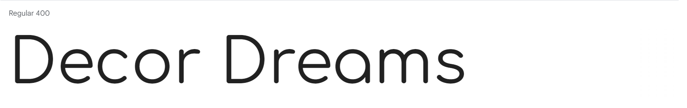

- [Open Sans](https://fonts.google.com/specimen/Open+Sans?preview.text=Decor%20Dreams&query=open) for Content:


### Wireframes

I utilized Balsamiq to design the wireframes for the website.

<details>
 <summary>Home Page</summary>


</details>

<details>
 <summary>Shop Products</summary>


</details>

<details>
 <summary>Product Details</summary>

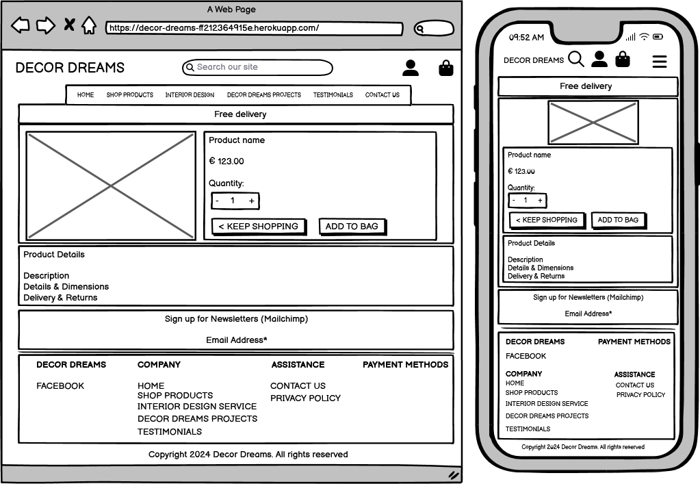
</details>

<details>
 <summary>Interior Design</summary>


</details>

<details>
 <summary>Decor Dreams Projects</summary>


</details>

<details>
 <summary>Testimonials</summary>


</details>

<details>
 <summary>Contact</summary>


</details>

<details>
 <summary>Shopping Bag</summary>

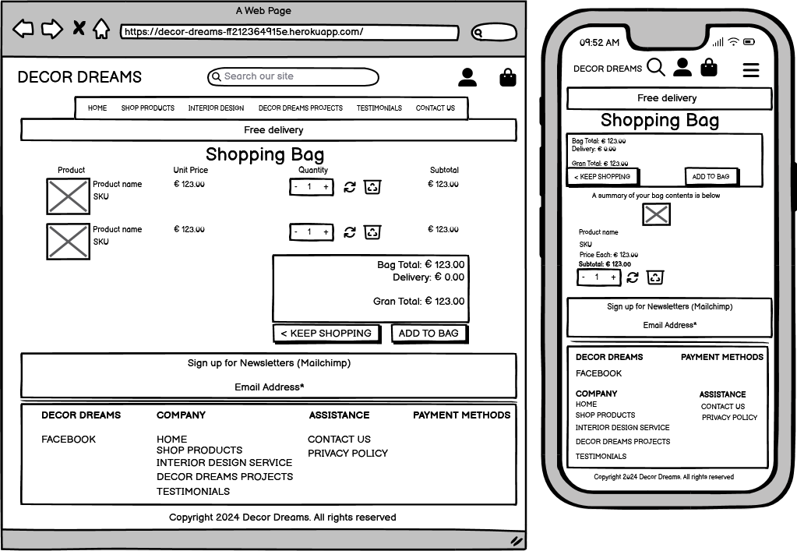
</details>

<details>
 <summary>Checkout</summary>


</details>

<details>
 <summary>Order Confirmation</summary>


</details>

<details>
 <summary>Consultation</summary>


</details>

<br>

[Back to Contents](#contents)

---

## Agile Methodology

GitHub Projects was utilized to facilitate the development process following an agile methodology. You can refer to the project board through this [link](https://github.com/users/IzabellaLopes/projects/3).

The 9 Epics mentioned earlier were documented as Milestones within the GitHub project. Each User Story was represented by a GitHub Issue, which was subsequently assigned to a milestone (Epic). Clear acceptance criteria were defined for each User Story to indicate when it is considered complete. Furthermore, these acceptance criteria were detailed into tasks, streamlining the execution of each User Story.

[Back to Contents](#contents)

---

## Database Diagram

The Decor Dreams project's data model adheres to Object-Oriented Programming principles and utilizes Django's Class-Based Generic Views.

User authentication is managed through Django AllAuth.

During development, SQLite was utilized as the relational database, while Postgres was employed for the Heroku-deployed version.

An entity relationship diagram was crafted using [Lucidchart](https://lucid.app/documents#/dashboard).

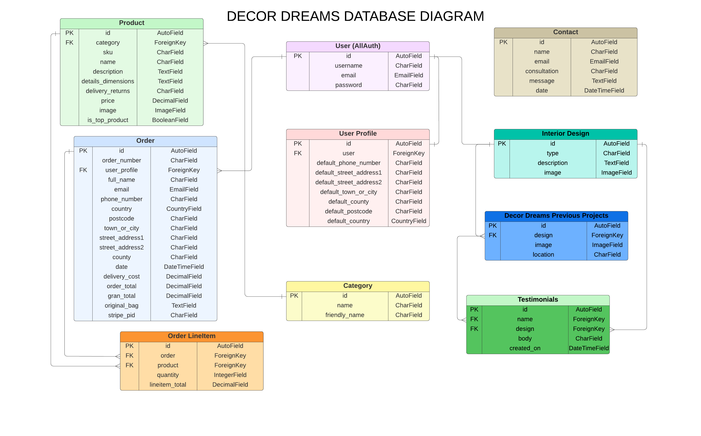

[Back to Contents](#contents)

---

## Security Features and Defensive Design

In the Decor Dreams project, robust user authentication and security features have been implemented to ensure a secure and reliable user experience.

### User Authentication

In Decor Dreams, I've implemented robust security measures for user authentication.

- LoginRequiredMixin: Employing Django's `LoginRequiredMixin`, any attempt by non-authenticated users to access secure pages results in an automatic redirection to the login page. This ensures that sensitive sections of the application are accessible only to authenticated users.

- UserPassesTestMixin: To finely control access based on specific permissions, I utilize Django's `UserPassesTestMixin`. For example, users can only edit/delete Testimonials for which they are the author or if the user is the superuser. If a user fails these tests, a clear HTTP 403 Forbidden error is displayed, maintaining a secure environment.

Where I have used function based views I have used Django's login_required and user_passes_test decorators to restrict access as required.

### Form Validation

I've implemented thorough form validation mechanisms to enhance data integrity.

- If incorrect or empty data is detected in a form submission, the form prevents submission, and a user-friendly warning appears. This approach ensures that users receive prompt feedback about the specific fields causing errors.

### Database Security

My approach to database security prioritizes confidentiality and protection against unauthorized access.

- The database URL and secret key are stored in a separate env.py file, preventing unintended database connections. 
- Stripe keys and wh secret are also stored in the env.py file. 

This practice was established before the initial push to Github, safeguarding sensitive information.

### Cross-Site Request Forgery (CSRF) Protection

Decor Dreams employs CSRF tokens on all forms throughout the site, providing an additional layer of defense against cross-site request forgery attacks.

### Custom Error Pages

Custom Error Pages were created to give the user more information on the error and to provide them with buttons to guide them back to the site.

- 400 Bad Request: The Decor Dreams is unable to process a request, providing a clear message to the user.
- 403 Forbidden: In cases of attempting to access forbidden content, the user is guided to log out and sign in to the correct account through a custom 403 Forbidden page.
- 404 Not Found: A custom 404 page assists users in navigating back to the site when the requested page doesn't exist.
- 500 Internal Server Error:  During server errors, users are informed through a custom 500 Internal Server Error, helping them understand the temporary unavailability of certain functionalities.

[Back to Contents](#contents)

---

## Features

### Favicon

The website features a favicon that is visible in the browser tab.


### Header


**Logo**

I created two custom logos using Canva:
  
- One in a horizontal format tailored for larger devices:


- And another in a rounded shape suitable for medium and small devices.


- The text is styled in dark green, while the circle surrounding it is light green, mirroring the main color scheme of the website. 
- Positioned in the center is a modern house with a flourishing plant, symbolizing the growth of dreams to decorate your house.
- The logo is situated in the top-left corner of the navigation bar and serves as a clickable link to the home page, enhancing user navigation.

**Navigation Bar**

- The navigation bar is consistently located at the top of each page, providing easy access to various sections.

**Search Bar**

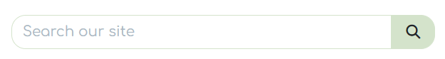
- The search bar appears above the navigation bar.
- On smaller screens, this bar transforms into a search icon. Upon clicking the icon, the full search bar drops down.
- Any entered search term will be matched against the product's title or description, and the results will be displayed on the product's page.

**User Icon**

- The User icon in the navigation bar serves as a dropdown menu containing the "Register" and "Sign in" links.
  


  - Once a user logs in, their username will be displayed below the user icon.
The options to "Register" or "Sign in" will change to "Log out" after a user has logged in.
- After logging in, the "My Profile" option becomes accessible in the User dropdown.


- If the superuser has signed in, additional options such as 'Add a Product', 'Add an Interior Design Service', 'Add a Decor Dreams Project', and 'Check Consultations' become available in the User dropdown.
  


- The navigation bar is fully responsive, collapsing into a hamburger menu when the screen size becomes too small.
- When hovering over the links, the font color changes to green and a golden bottom border appears.
- Additionally, when a link is active, it will feature a golden bottom border.

**Bag Icon**


- Situated on the right side of the navbar next to the User icon is the Bag icon.
- When a product is added to the bag, the initial price of €0.00 will adjust according to the items in the bag.
- As the user adds more products to their bag, a toast message appears in the top right corner of the screen, informing the user of the added item. It includes a quick view of the bag contents and the updated total cost.


- Clicking the bag icon navigates the user to the shopping bag page which displays a summary of what's been added.

**Banner**


- Below the navigation bar is an animated banner, where the sign "Free delivery on orders over €250!" grabs users' attention to encourage purchases. 
- The €250 threshold can be easily adjusted in the settings.py file by modifying the FREE_DELIVERY_THRESHOLD variable.

### Mailchimp


- There is a newsletter signup section powered by Mailchimp, allowing users to enter their email address to subscribe to newsletters and receive email updates about our new stock.

### Footer

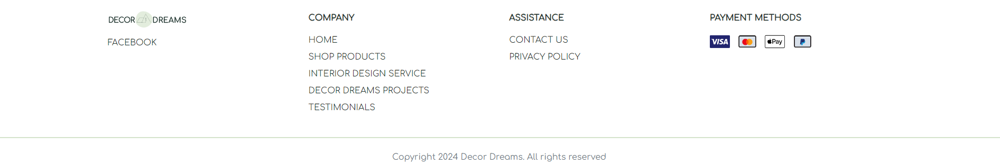

- The footer is visible at the bottom of each page.
- It contains a link to the [Decor Dreams Facebook page](https://www.facebook.com/people/Decor-Dreams/61557145091799/). Clicking on external links will open the respective website in a new tab, preventing users from being redirected away from the site.
- The Quick Links section provides access to key parts of the site, including the ['Privacy Policy'](https://www.termsfeed.com/live/7bb0d942-6e1d-46d9-ac3c-1fe8a915cdb6).
- On the right-hand side of the footer, icons representing various payment methods are displayed to draw attention and encourage users to make purchases.

### Home Page

**Hero-callout section**

- The homepage showcases a prominent callout section with an animated slogan: "DECOR YOUR DREAMS: Your destination for all your home decor needs."
- Additionally, it includes two primary links for users: "Shop now," which directs users to browse products, and "Schedule a consultation," which redirects users to the Interior Design Service page.


**Who we are section**

The "Who we are" section offers a brief summary of the site's offerings, highlighting key features and incorporating relevant keywords within <strong></strong> tags to enhance the site's search ranking


### User Account Pages

- Django Allauth was installed and utilized to implement Sign Up, Log In, and Log Out functionalities. 
- Success messages inform users about successful login and logout actions, while error messages notify them of any unsuccessful attempts during these processes.
- When a user registers for an account, they need to verify their email address by clicking on the authentication link sent to the provided email address.
- If a user forgets their password, they can reset it by clicking on the 'Forgot Password' link on the login page.

#### Sign Up


#### Sign In


#### Sign Out


### Profile


**Delivery Details Information**

- The delivery details section stores the user's delivery address and phone number, where the user can also update their information.
- This information is utilized to automatically populate the delivery address during the checkout process.

**Order History**

- The order history section exhibits a comprehensive list of all the user's placed orders.
- Within the table, users can view the order number, order date, and total amount.
- By clicking on the order number, users are directed to a summary page providing details of that specific order.

### Shop Products

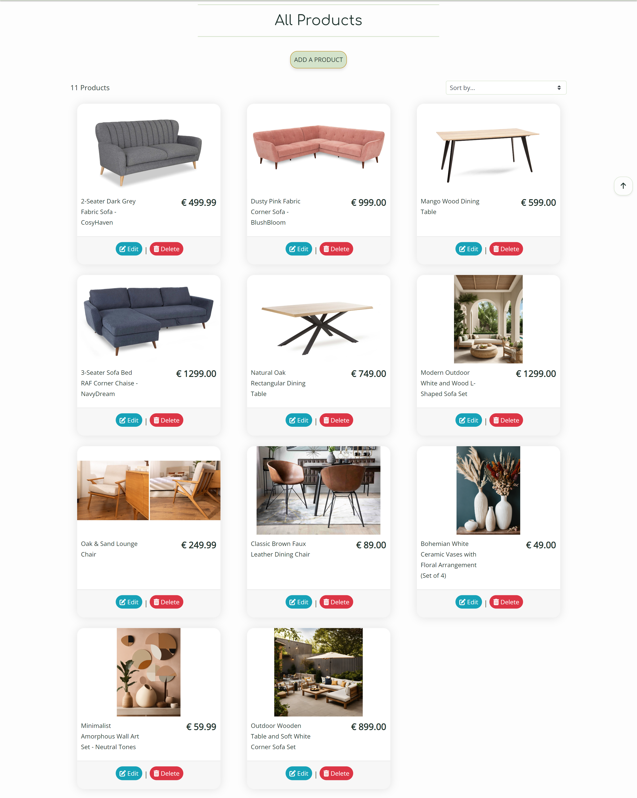

- Upon selecting the 'Shop Products' link in the navigation bar, a dropdown menu will appear, presenting various categories such as 'Sofas,' 'Tables & Desks,' 'Chairs,' 'Outdoor Living,' and 'Decoration.'


- The 'All Products' link will showcase a list of all products sourced from the database. 
- Upon clicking any category, the product list will be filtered to exclusively exhibit items belonging to the chosen category.
- The chosen category will then be prominently displayed as the heading of the page.

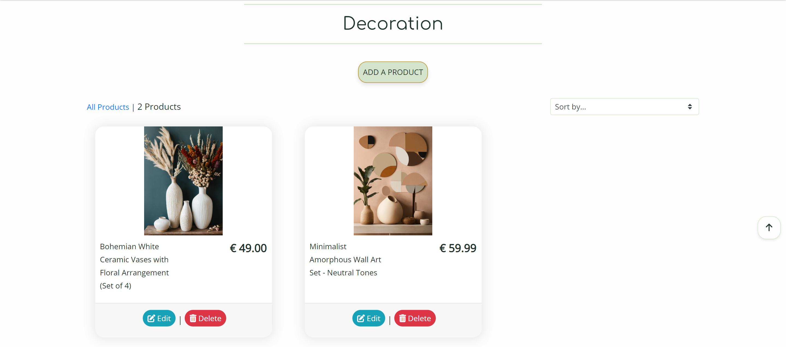

- Every product card features an image of the product, along with its product name, and price. 
- For superusers, additional edit and delete buttons are displayed at the bottom of each product card.
- The products page is designed to be fully responsive, dynamically adjusting the number of products displayed on each row according to the user's screen size.
- Additionally, a sorting box is available on the products page, allowing users to sort all products by price in ascending or descending order, as well as by title in alphabetical order.

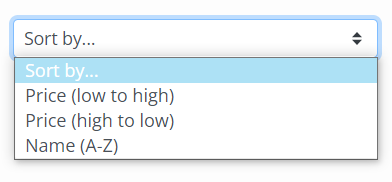

### Product Details


- When a user clicks on an individual product card, they are directed to the complete product details page. The link is designed as a bootstrap stretched link, allowing users to click anywhere on the card to access the details.

- On the product detail page, users can view the product image, name, and price. If the user is a superuser, they will see edit and delete buttons beneath these details.

**Quantity Buttons:**
- Below the main product details, users will find quantity buttons used to add items to their bag.
- These buttons allow users to increase or decrease the quantity by clicking the plus and minus buttons respectively.
- The minus button is disabled when the quantity is set to 1, and the plus button is disabled when the quantity is set to 99.
- If a user manually enters a negative number or a number greater than 99 and clicks "Add to Bag," an error message will appear, prompting the user to input valid parameters.
- Clicking the 'Add to Bag' button adds the specified quantity of the product to the bag, while clicking 'Keep Shopping' returns the user to the store.

**Product Details Accordion:**
- Below these main details lies the product details accordion, an interactive box where users can select information such as:

- Description:
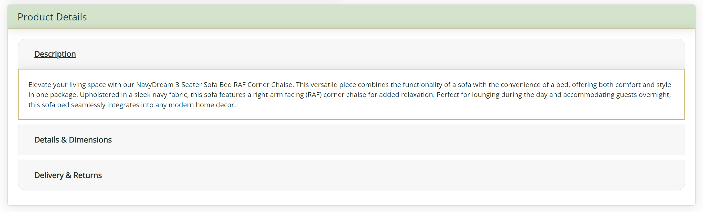

- Details and Dimensions:


- Delivery and Returns:


### Products Management

#### Add a Product


- The "Add Product" page is accessible by clicking the corresponding button on the products page or within the user dropdown menu, under the "Add a Product" section. These options are exclusively visible to superusers.

- If a user attempts to access the add product page by altering the URL without superuser privileges, they will be redirected to the sign in page.

- To successfully submit the form, the user must complete all fields marked with an asterisk.
  
- If any of these mandatory fields are left blank or contain only whitespace upon submission, an error message will appear above the respective field, alerting the user to the issue.


- The SKU field must be unique; if the entered SKU already exists, an error message will be displayed.


- If the price entered exceeds six digits, the form will fail, and an error message will appear beneath the price field.

- Users have the option to upload a photo for their product. If they opt not to, a default image will be displayed as the product image.

- Upon clicking the "Add Product" button at the bottom of the form, the product will be created, provided there are no errors present.

- A success message will be displayed, informing the user that the product has been successfully added.


#### Edit a Product

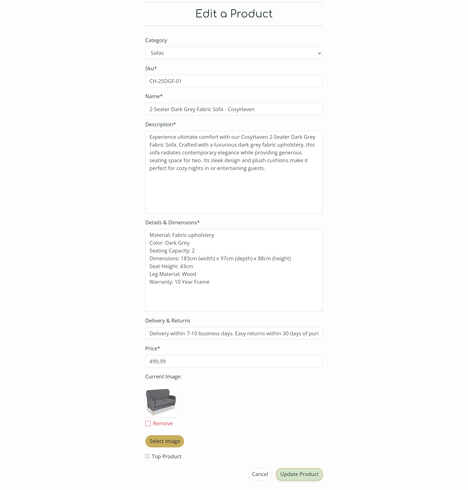

- The superuser has the option to edit a product either by clicking the edit button on the product card or on the product detail page.

- Upon opening the edit form, all fields are pre-populated with the original content.

- In the image field, a thumbnail of the existing image is displayed, along with a checkbox option to remove it. Checking this checkbox will replace the image with the default one.

- If a user attempts to edit a product by altering the URL without superuser privileges, they will be redirected to the sign in page.

- Upon successful update, the superuser will receive a notification confirming that the product has been successfully updated.


#### Delete a Product


- The superuser has the option to delete a product by clicking the delete button on either the product card or the product detail page.

- Upon clicking the delete button, the superuser is prompted to confirm their decision to delete the product or to cancel the action.

- Once the deletion process is successfully executed, the superuser will receive a notification confirming that the product has been deleted.

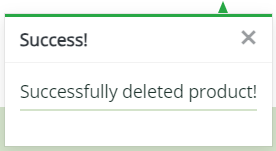

### Shopping Bag

- After successfully adding a product, the shopper will receive a notification confirming the successful addition of the product to their bag.


- Clicking either on the shopping bag icon in the navigation bar or on the "Go to secure checkout" button in the previous message redirects users to the shopping bag page.


- This page displays all the products that users have added to their cart, along with details such as unit price, quantity, and subtotal.

**Quantity Buttons:**

- The quantity input box on this page reflects the quantity of each product added to the bag.
- Users can adjust the quantity using the plus and minus buttons:
  


- The plus button increases the quantity.
- The minus button decreases the quantity.
- If the quantity is set to 1, the minus button is disabled.
- Similarly, if the quantity reaches 99, the plus button becomes disabled.

**Update and Delete Buttons:**

- Users have the option to update or delete items from their shopping bag using the corresponding buttons provided on the page.


- Clicking the 'Update' icon button saves any changes made to the quantity and updates the item's subtotal accordingly.
- Pressing the 'Bin' icon button removes the item entirely from the user's bag. 
- If the user inputs a negative number manually and clicks 'update', the respective item will be removed from the bag. 
- Similarly, if the user enters a number greater than 99 and clicks 'update', an error message will appear, prompting the user to input within the correct parameters.

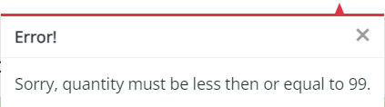

**Total Section:**

- At the bottom of the line items, a summary of costs is provided. 
- This summary includes the total cost of the items in the bag, the delivery cost, and the grand total to pay. 
- Below the grand total, users will find a message indicating how much more they need to spend to qualify for free delivery if they haven't yet met the threshold (€ 250).
- Additionally, two buttons are available below the grand total: users can either return to the products page by clicking 'Keep Shopping' or proceed to checkout by clicking 'Secure Checkout'.


### Checkout

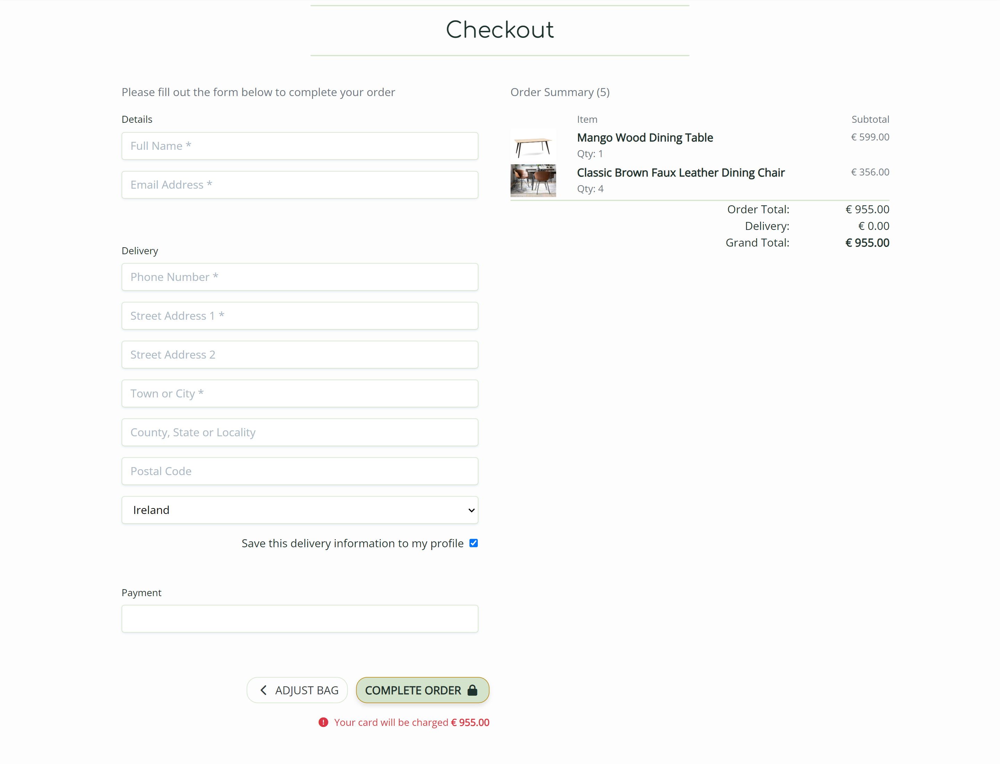

**Users Details:**
- In this section, users can input their contact details, delivery address, and card number for making purchases.
- If the user is a guest, they will find a link to create an account or login.

- For signed-in users, a checkbox is available to save delivery information. 
- If delivery information is saved, it will be automatically filled in along with the email address.
- Error messages will prompt users to fill in required fields or match the requested format if any discrepancies are found.

**Order Summary:**
- The order summary provides a breakdown of all items to be purchased, including quantity, subtotal, and grand total. 
- The total number of items in the order is displayed alongside the summary title.
- Clicking on a product image within the summary redirects the user to the corresponding product detail page.

**Payment:**
- Payment processing is securely handled by Stripe. 
- Incorrect card numbers trigger an error message indicating an invalid card number. 
- A loading screen prevents users from navigating away while payment is being processed. 
- A warning message displays the impending charge on the user's card. 
- In case of submission errors or browser closure during processing, orders are still created in the database through the webhook. 
- Upon successful payment processing, the webhook verifies the existence of the order in the database and creates one if not found, using the payment information provided.

**Confirmation:**
- After the order is processed, the user is directed to the checkout success page, which provides a summary of the completed order. 


- Additionally, a success message is displayed, and an email containing the order confirmation is sent to the user. 
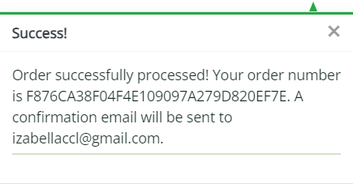
  
- At the bottom of the summary, a "Keep Shopping" button is available, allowing the user to return to the 'Shop products' page.

### Interior Design


- The Interior Design page is accessible via the link in the navigation bar. 
- Upon arrival, users are greeted with a thorough list of services offered by Decor Dreams, including 'Full Interior Design Services', 'Color Consultation', 'Lighting Design', and 'Outdoor Living Design'. 
- Each service is accompanied by images, titles, and detailed descriptions. 
- An "Schedule a Consultation" button is positioned alongside each service, allowing users to easily navigate to the Contact form upon clicking. 
- For superusers, additional edit and delete buttons are displayed at the bottom of each interior design service. 

### Interior Design Management

#### Add a Interior Design Service

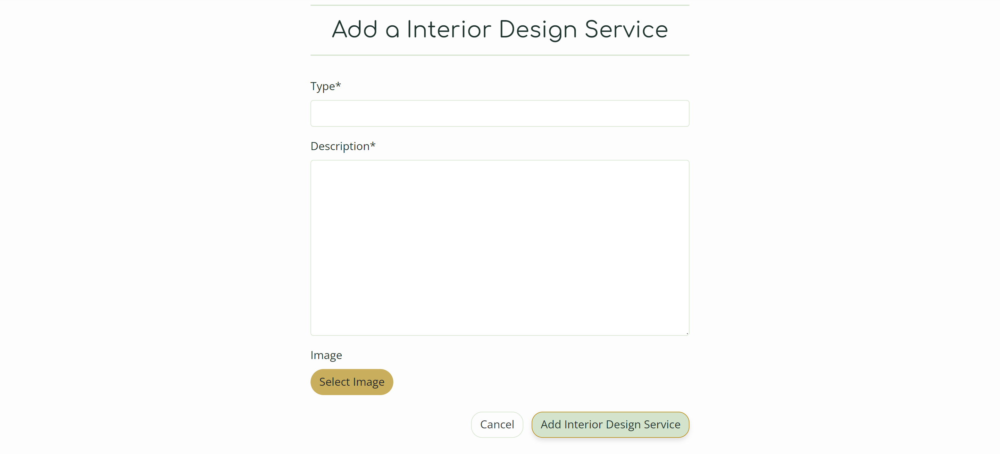

- The "Add a Interior Design Service" page is accessible by clicking the corresponding button on the Interior Design page or within the user dropdown menu, under the "Add a Interior Design Service" section. These options are exclusively visible to superusers.

- If a user attempts to access the add interior design page by altering the URL without superuser privileges, they will be redirected to the sign in page.

- To successfully submit the form, the user must complete all fields marked with an asterisk.
  
- If any of these mandatory fields are left blank or contain only whitespace upon submission, an error message will appear above the respective field, alerting the user to the issue.

- Users have the option to upload a photo for their interior design service. If they opt not to, a default image will be displayed as the interior design image.

- Upon clicking the "Add Interior Design Service" button at the bottom of the form, the interior design service will be created, provided there are no errors present.

- A success message will be displayed, informing the user that the interior design service has been successfully added.


#### Edit a Interior Design Service

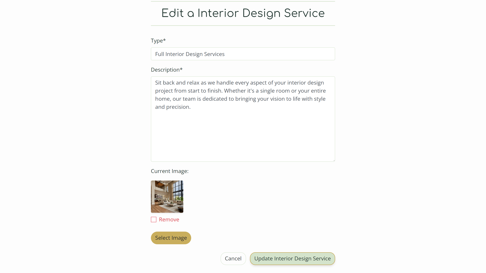

- The superuser has the option to edit a Interior Design Service by clicking the edit button located beneath the service description on the Interior Design Services Page. 
  
- Upon clicking, the form will appear with all fields pre-filled with the existing content. 

- Within the form, the image field will exhibit a thumbnail of the current image and provide a checkbox option to remove it. 
  
- Selecting this checkbox will replace the image with the default one. 
  
- If a non-superuser attempts to add a service by altering the URL, they will be redirected to a sign in.

- Upon successful update, the superuser will receive a notification confirming the service's update.


#### Delete a Interior Design Service


- The superuser has the option to delete a Interior Design Service by selecting the delete button situated below the service description on the Interior Design Services Page. 
- Upon clicking, the superuser will be prompted to confirm their choice to delete the service or to cancel the action. 
- Following successful deletion, the superuser will be presented with a notification confirming the service's removal.


#### Decor Dreams Projects


- When users click on the "Decor Dreams Projects" tab in the navigation bar, they are directed to a page displaying images of projects by Decor Dreams, situated in various locations across Ireland.
- In desktop view, hovering over the image reveals the type of design service and location at the center of the image. 
- On mobile devices, this information appears below the image.
- Clicking on the image opens it in a new tab for further exploration.

### Decor Dreams Projects Management

#### Add a Decor Dreams Project


- The "Add a Decor Dreams Project" page is accessible by clicking the corresponding button on the Decor Dreams Projects page or within the user dropdown menu, under the "Add a Decor Dreams Project" section. These options are exclusively visible to superusers.

- If a user attempts to access the add interior design page by altering the URL without superuser privileges, they will be redirected to the sign in page.

- To successfully submit the form, the user must complete all fields marked with an asterisk.
  
- If any of these mandatory fields are left blank or contain only whitespace upon submission, an error message will appear above the respective field, alerting the user to the issue.

- Upon clicking the "Add Decor Dreams Project" button at the bottom of the form, the project will be created, provided there are no errors present.

- A success message will be displayed, informing the user that the interior design service has been successfully added.


#### Edit a Decor Dreams Project

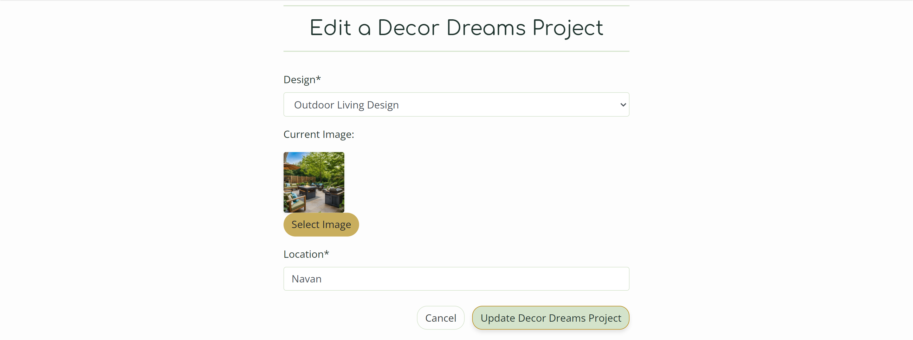

- The superuser has the option to edit a Decor Dreams Project by clicking the edit button located beneath the project description on the Decor Dreams Projects Page. 
  
- Upon clicking, the form will appear with all fields pre-filled with the existing content. 

- Within the form, the image field will exhibit a thumbnail of the current image and provide a checkbox option to remove it. 
  
- Selecting this checkbox will replace the image with the default one. 
  
- If a non-superuser attempts to add a service by altering the URL, they will be redirected to a sign in. 

- Upon successful update, the superuser will receive a notification confirming the service's update.


#### Delete a Decor Dreams Project


- The superuser has the option to delete a Decor Dreams Project by selecting the delete button situated below the service description on the Decor Dreams Projects Page. 
- Upon clicking, the superuser will be prompted to confirm their choice to delete the project or to cancel the action. 
- Following successful deletion, the superuser will be presented with a notification confirming the projects's removal.


### Testimonials

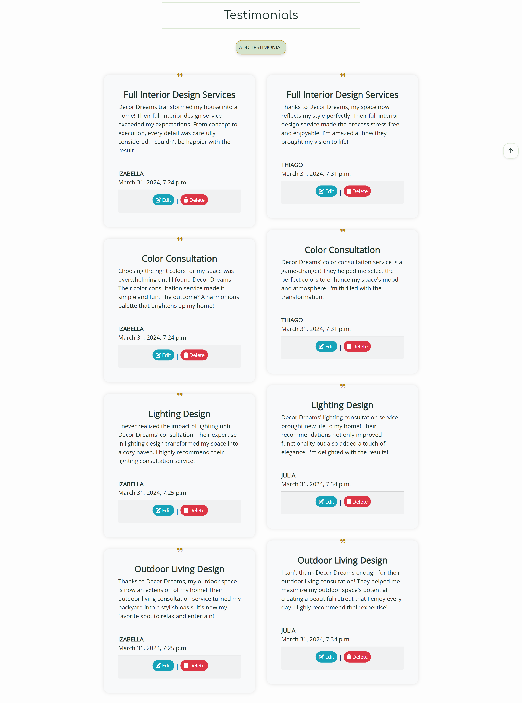

- To access the testimonials page, navigate to the link provided in the navigation bar.
- Upon reaching the page, users will discover a compilation of testimonials contributed by previous clients.
- Each testimonial contains information such as the corresponding Interior Design Service, submission date, and the name of the user who submitted it.
- The "Add Testimonial" button at the top of the page is visible to everyone
- The "Edit" and "Delete" buttons, located beneath each respective testimonial, are only visible to the superuser and the user who added the testimonial. For example, if the user IZABELLA, who added some testimonials, accesses the testimonial page, she will see it like this:

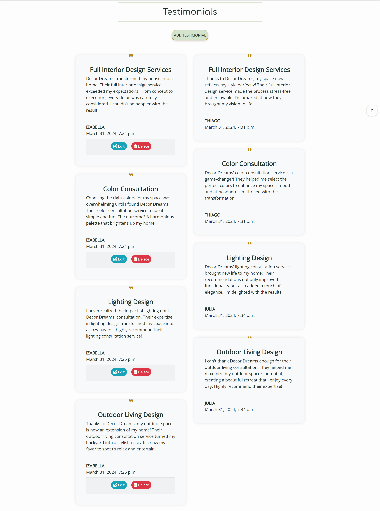

### Testimonials Management

#### Add Testimonials


- When a logged-in user clicks on the "Add Testimonial" button on the Testimonials page, they are presented with a user-friendly form where they can submit a new testimonial to the site.
- If the user is not logged in, they will be redirected to the sign in page.
- Once submitted, the testimonial automatically includes the user's username and the current date underneath the text.
- A success message will be displayed, informing the user that the testimonial has been successfully added.

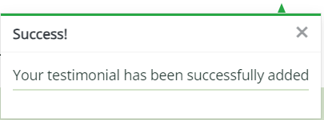

#### Edit Testimonials


- Users can edit their own testimonials by clicking the edit button displayed beside their testimonial on the Testimonials Page. 
- The edit form fields are automatically filled with the existing testimonial text. 
- If a user attempts to update a testimonial (by altering the URL) without being signed in, they will be redirected to the login page. 
- Similarly, if a user tries to update another user's testimonial (by modifying the URL), they will receive a custom 403 error message. 
- However, the superuser has the authority to edit anyone's testimonial. 
- After successfully updating a testimonial, the user will receive a notification confirming the update.

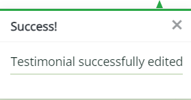

#### Delete Testimonials


- Users can opt to delete their own testimonials by clicking the delete button displayed beside their testimonial on the Testimonials Page. 
- Upon clicking, they are prompted to confirm their decision to delete the testimonial or cancel the action. 
- Following successful deletion, the user receives a notification confirming the deletion. 
- If a user attempts to delete a testimonial (by altering the URL) without being signed in, they will be redirected to the login page. 
- Similarly, if a user tries to delete another user's testimonial (by modifying the URL), they will receive a custom 403 error message. 
- However, the superuser has the authority to delete anyone's testimonial.
- After successfully deleting a testimonial, the user will receive a notification confirming the deletion.

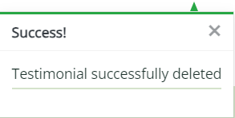

### Contact

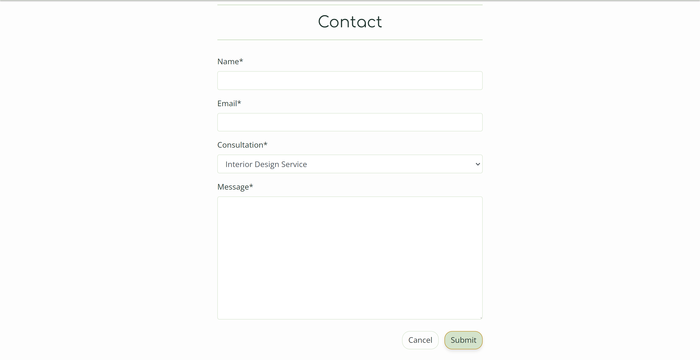

- Users can access the contact form by clicking on the "Schedule a consultation" button on the Interior Design page or by selecting the 'Contact us' button in the navigation bar.
- If the user is logged in, the email field is automatically populated with their email address.
- The form includes a dropdown menu allowing users to select the type of consultation from a predefined list, ensuring clarity for the site owner.
- Required fields are marked with an asterisk, and the user must complete all such fields.
- If any required field is left blank or contains only whitespace upon submission, an error message will appear above the respective field, prompting the user to rectify the issue. 

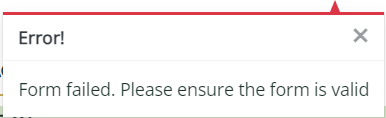

- After submitting the form, the user will receive a success message, be redirected to the 'Contact Confirmation' page, and receive an email confirming their inquiry for their records.

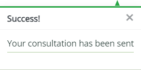


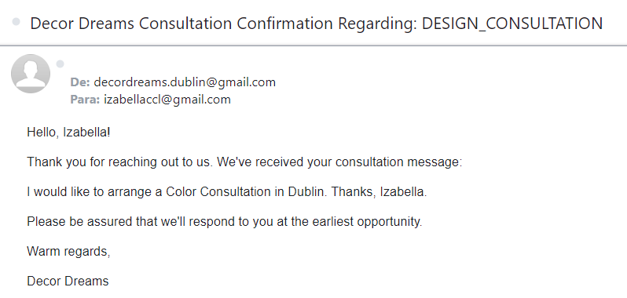

### Check Consultations

- When the site owner logs in, they'll find an "Check Consultations" button in the contact us page and an option in the User drop-down menu.

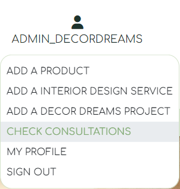


#### Consultation Dashboard

- Upon navigating to the Consultation page, they'll encounter a list of user enquiries arranged from newest to oldest.


- Read emails will be visually distinguished by appearing in lightgreen color. 

### Consultations Management

#### Consultation Detail

- Clicking on any enquiry will direct the site owner to its detailed information page.

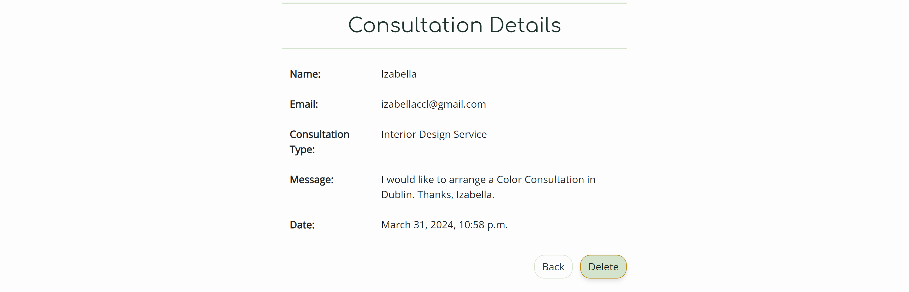

#### Delete Consultation 

- The site owner can choose to delete the enquiry or to go back to the list of enquiries.


- Upon deletion, a success message will be displayed.

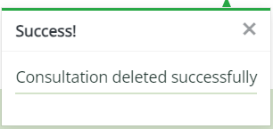

### Error Pages

As mentioned earlier, Custom Error Pages were designed to offer users additional information about the error and provide them with buttons for navigating back to the site.


- 400 Bad Request: Decor Dreams is unable to handle this request.

- 403 Forbidden: Looks like you're trying to access forbidden content. Please log out and sign in to the correct account.

- 404 Not Found: The page you're looking for doesn't exist.

- 500 Internal Server Error: Due to an internal error we are unable to process this request.

[Back to Contents](#contents)

---

## E-commerce Business Model

Decor Dreams follows a simple Business to Customer (B2C) model, catering to individual customers seeking luxurious home products and interior design services. Our model is designed to facilitate individual transactions without the need for subscriptions, making it accessible and user-friendly.

### SEO & Social Media Marketing

Various marketing strategies have been employed to promote Decor Dreams, including SEO, content marketing, social media marketing, and email marketing.

#### Search Engine Optimization (SEO)

- **Keywords**: 
  - We've identified a mix of short-tail and long-tail keywords that align with our products and brand, optimizing our site's visibility in search engine results.
  - The most relevant keywords have been added to the site's meta-keywords and meta-description. These keywords have also been carefully included in page titles, headings, site content, <strong></strong> tags, image alt attributes and anchor tag links across the site.

- **Building Trust**:
  - To establish brand trust, a dedicated testimonial page showcasing interior design services has been integrated into the site. The link to this page is conveniently included both in the page footer and the main navigation bar.
  - Additionally, the page footer provides links to the privacy policy, ensuring users are informed about the collection and processing of their data.

- **Sitemap & Robots.txt**: 
  - To aid in search engine indexing, we have generated a sitemap.xml and configured a robots.txt file, ensuring search engines can crawl our site efficiently.
  - A sitemap file with a list of important page URLs was created to ensure that search engines are able to understand the site's structure and easily navigate through the site. This was made using xml-sitemaps.com.
  - A robots.txt file was created to tell search engines where they are not allowed to go on the website. This improves SEO by increasing the quality of the site

```
User-agent: *
Disallow: /accounts/
Disallow: /bag/
Disallow: /checkout/
Disallow: /profile/
Sitemap: https://decor-dreams-ff212364915e.herokuapp.com/sitemap.xml
```

#### Social Media Presence

- **Facebook Business Page**: 
  - We have established a presence on Facebook, a platform with a vast user base, to connect with our community, showcase our products, and drive traffic to our site. Our Facebook page serves as a platform for announcements, product highlights, and customer engagement.

  

#### Newsletter Engagement

- **Newsletter Sign-up**: 
  - Site visitors have the option to subscribe to the newsletter without the necessity of creating an account. A subscription box is conveniently placed above the site footer, enabling users to sign up. This feature enables the business to disseminate news, such as updates on new products/services and special offers, to both existing and potential customers. Mailchimp was employed to establish and manage this service.

#### Future Marketing Strategies

- **Google Search Console**: Plans to utilize tools like Google Search Console for deeper insights into our site's search performance.
- **Enhanced Social Media Campaigns**: We aim to leverage social media platforms further by engaging with our community through regular updates, interactive posts, and promotional events.

[Back to Contents](#contents)

---

## Testing

Comprehensive manual testing was conducted to ensure all functionalities work as intended. Details provided in [TESTING.md](TESTING.md).

[Back to Contents](#contents)

---

## Technologies Used

### Languages Used

- [HTML5](https://en.wikipedia.org/wiki/HTML5)
- [CSS3](https://en.wikipedia.org/wiki/CSS)
- [JavaScript](https://en.wikipedia.org/wiki/JavaScript)
- [Python](https://en.wikipedia.org/wiki/Python_(programming_language))

### Databases Used

- [ElephantSQL](https://www.elephantsql.com/) - Postgres database
- [AWS](https://aws.amazon.com/) - Online static/media file storage

### Frameworks Used

- [Django](https://www.djangoproject.com/) - Python framework
- [Bootstrap 4.6](https://getbootstrap.com/docs/4.6/getting-started/introduction/) - CSS framework

### Programs Used

- [VS Code](https://code.visualstudio.com/) - IDE used to create the Decor Dreams.
- [GitHub](https://github.com/) - Used for file storage, version control, and agile tool.
- [Heroku](https://www.heroku.com/) - Used to deploy the project.
- [Django](https://www.djangoproject.com/) - Main python framework used in the development of this project.
- [Django-allauth](https://pypi.org/project/django-allauth/) - Authentication library used to create the user accounts.
- [Crispy Forms](https://django-crispy-forms.readthedocs.io/en/latest/) - Used to manage Django Forms.
- [Bootstrap 4.6](https://getbootstrap.com/docs/4.6/getting-started/introduction/) - CSS Framework for developing responsiveness and styling.
- [PostgreSQL](https://www.postgresql.org/) - Used as the database for this project.
- [Stripe](https://stripe.com/ie) - Used for the payments system.
- [AWS](https://aws.amazon.com/?nc2=h_lg) - Used for file storage.
- [Balsamiq](https://balsamiq.com/) - Used to generate Wireframes.
- [Coolors](https://coolors.co/) - Used to create color palette.
- [Google Fonts](https://fonts.google.com/) - Used to import and alter fonts on the page.
- [WebAIM Contrast Checker](https://webaim.org/resources/contrastchecker/) - Used to check contrast.
- [Canva](https://www.canva.com/) - To create the logo.
- [Lexica Art](https://lexica.art/) - Used to generate Decor Dreams images.
- [Favicon.io](https://favicon.io/) - To create favicon.
- [Lucidchart](https://lucid.app/documents#/dashboard) - Used to create the database model design.
- [Chrome Dev Tools](https://developer.chrome.com/docs/devtools/) - To troubleshoot and test features, resolve issues related to responsiveness and styling.
- [Font Awesome](https://fontawesome.com/) - For the iconography on the website.
- [W3C](https://www.w3.org/) - Used for HTML & CSS Validation.
- [Code Institute Python Linter](https://pep8ci.herokuapp.com/) - Verify code conformity with PEP8.
- [Jshint](https://jshint.com/) - Used to validate Javascript.
- [Responsinator](http://www.responsinator.com/) - Used to verify responsiveness of website on different devices.
- [Techsini](https://techsini.com/multi-mockup/index.php) - To display the website image across various devices.
- [ChatGPT by OpenAI](https://chat.openai.com/) - Enhance Readme.md readability; streamline content for effective communication.
- [Web Disability Simulator](https://chrome.google.com/webstore/detail/web-disability-simulator/olioanlbgbpmdlgjnnampnnlohigkjla) - A Google Chrome extension that allows you to view your site as people with accessibility needs would see it.
- [Tables Generator](https://www.tablesgenerator.com/markdown_tables) - Used to convert excel testing tables to markdown.
- [Sitemap Generator](www.xml-sitemaps.com) - Used to create sitemap.xml .
- [Privacy Policy Generator](https://www.privacypolicygenerator.info/) - To generate privacy policy.
- [Mailchimp](https://mailchimp.com/?currency=EUR) - Used to create the newsletter signup functionality.

[Back to Contents](#contents)

---

## Deployment 

The website has been successfully deployed on Heroku. You can access the live site [here](https://decor-dreams-ff212364915e.herokuapp.com/).

### Code Institute Template 

To create a terminal-based user interface using the Code Institute Template:

1. Go to the [Code Institute Full Template](https://github.com/Code-Institute-Org/ci-full-template) and click on "Use this template."
2. Choose "Create a new repository."

### GitHub Setup
   - Log in to [Github](https://github.com/).
   - Access the repository for deployment. The repository for the website can be found [here](https://github.com/IzabellaLopes/decor_dreams).

### Heroku Setup
   - Log in to [Heroku](https://www.heroku.com/). 
   - Click the "New" button located in the top right corner..
   - Select "Create New App."
   - Provide a name for the app (decor-dreams) and choose a region (Europe).
   - Click the "Create app" button.
   - Navigate to the "Deploy" section in the navigation bar. Under "Deployment Method," choose GitHub/Connect to GitHub.
   - In the "Connect to GitHub" section, enter the repository name (decor-dreams) and click the search button.
   - Upon the repository link appearing in the search results, click the "Connect" button.

### Attach the Postgres database
   - In the Resources tab, under add-ons, type in Postgres and select the Heroku Postgres option.
   - This project uses [ElephantSQL](https://www.elephantsql.com) for the PostgreSQL Database.
   - To obtain your own Postgres Database, sign-up with your GitHub account, then follow these steps:
     - Click **Create New Instance** to start a new database.
     - Provide a name (this is commonly the name of the project: decor_dreams).
     - Select the **Tiny Turtle (Free)** plan.
     - You can leave the **Tags** blank.
     - Select the **Region** and **Data Center** closest to you.
     - Once created, click on the new database name, where you can view the database URL and Password.
    - Copy the DATABASE_URL located in Config Vars in the Settings Tab.

### Amazon AWS

This project uses [AWS](https://aws.amazon.com) to store media and static files online, due to the fact that Heroku doesn't persist this type of data.

Once you've created an AWS account and logged-in, follow these series of steps to get your project connected.
Make sure you're on the **AWS Management Console** page.

### S3 Bucket

- Search for **S3**.
- Create a new bucket, give it a name (matching your Heroku app name), and choose the region closest to you.
- Uncheck **Block all public access**, and acknowledge that the bucket will be public (required for it to work on Heroku).
- From **Object Ownership**, make sure to have **ACLs enabled**, and **Bucket owner preferred** selected.
- From the **Properties** tab, turn on static website hosting, and type `index.html` and `error.html` in their respective fields, then click **Save**.
- From the **Permissions** tab, paste in the following CORS configuration:

  ```shell
  [
      {
          "AllowedHeaders": [
              "Authorization"
          ],
          "AllowedMethods": [
              "GET"
          ],
          "AllowedOrigins": [
              "*"
          ],
          "ExposeHeaders": []
      }
  ]
  ```

- Copy your **ARN** string.
- From the **Bucket Policy** tab, select the **Policy Generator** link, and use the following steps:
  - Policy Type: **S3 Bucket Policy**
  - Effect: **Allow**
  - Principal: `*`
  - Actions: **GetObject**
  - Amazon Resource Name (ARN): **paste-your-ARN-here**
  - Click **Add Statement**
  - Click **Generate Policy**
  - Copy the entire Policy, and paste it into the **Bucket Policy Editor**

    ```shell
    {
        "Id": "Policy1234567890",
        "Version": "2012-10-17",
        "Statement": [
            {
                "Sid": "Stmt1234567890",
                "Action": [
                    "s3:GetObject"
                ],
                "Effect": "Allow",
                "Resource": "arn:aws:s3:::your-bucket-name/*"
                "Principal": "*",
            }
        ]
    }
    ```

  - Before you click "Save", add `/*` to the end of the Resource key in the Bucket Policy Editor (like above).
  - Click **Save**.
- From the **Access Control List (ACL)** section, click "Edit" and enable **List** for **Everyone (public access)**, and accept the warning box.
  - If the edit button is disabled, you need to change the **Object Ownership** section above to **ACLs enabled** (mentioned above).
  
### IAM

Back on the AWS Services Menu, search for and open **IAM** (Identity and Access Management).
Once on the IAM page, follow these steps:

- From **User Groups**, click **Create New Group**.
  - Suggested Name: `manage-decor-dreams` (manage + the project name)
- Tags are optional, but you must click it to get to the **review policy** page.
- From **User Groups**, select your newly created group, and go to the **Permissions** tab.
- Open the **Add Permissions** dropdown, and click **Attach Policies**.
- Select the policy, then click **Add Permissions** at the bottom when finished.
- From the **JSON** tab, select the **Import Managed Policy** link.
  - Search for **S3**, select the `AmazonS3FullAccess` policy, and then **Import**.
  - You'll need your ARN from the S3 Bucket copied again, which is pasted into "Resources" key on the Policy.

    ```shell
    {
        "Version": "2012-10-17",
        "Statement": [
            {
                "Effect": "Allow",
                "Action": "s3:*",
                "Resource": [
                    "arn:aws:s3:::your-bucket-name",
                    "arn:aws:s3:::your-bucket-name/*"
                ]
            }
        ]
    }
    ```

  - Click **Review Policy**.
  - Suggested Name: `decor-dreams-policy` (project name + policy)
  - Provide a description:
    - "Access to S3 Bucket for decor-dreams static files."
  - Click **Create Policy**.
- From **User Groups**, click your `manage-decor-dreams`.
- Click **Attach Policy**.
- Search for the policy you've just created ("decor-dreams-policy") and select it, then **Attach Policy**.
- From **User Groups**, click **Add User**.
  - Suggested Name: `decor-dreams-staticfiles-user` (project name + staticfiles + user)
- For "Select AWS Access Type", select **Programmatic Access**.
- Select the group to add your new user to: `manage-decor-dreams`
- Tags are optional, but you must click it to get to the **review user** page.
- Click **Create User** once done.
- You should see a button to **Download .csv**, so click it to save a copy on your system.
  - **IMPORTANT**: once you pass this page, you cannot come back to download it again, so do it immediately!
  - This contains the user's **Access key ID** and **Secret access key**.
  - `AWS_ACCESS_KEY_ID` = **Access key ID**
  - `AWS_SECRET_ACCESS_KEY` = **Secret access key**

### Final AWS Setup

- If Heroku Config Vars has `DISABLE_COLLECTSTATIC` still, this can be removed now, so that AWS will handle the static files.
- Back within **S3**, create a new folder called: `media`.
- Select any existing media images for your project to prepare them for being uploaded into the new folder.
- Under **Manage Public Permissions**, select **Grant public read access to this object(s)**.
- No further settings are required, so click **Upload**.

### Stripe API

This project uses [Stripe](https://stripe.com) to handle the ecommerce payments.

Once you've created a Stripe account and logged-in, follow these series of steps to get your project connected.

- From your Stripe dashboard, click to expand the "Get your test API keys".
- You'll have two keys here:
  - `STRIPE_PUBLIC_KEY` = Publishable Key (starts with **pk**)
  - `STRIPE_SECRET_KEY` = Secret Key (starts with **sk**)

As a backup, in case users prematurely close the purchase-order page during payment, we can include Stripe Webhooks.

- From your Stripe dashboard, click **Developers**, and select **Webhooks**.
- From there, click **Add Endpoint**.
  - `https://decor-dreams-ff212364915e.herokuapp.com/checkout/wh/`
- Click **receive all events**.
- Click **Add Endpoint** to complete the process.
- You'll have a new key here:
  - `STRIPE_WH_SECRET` = Signing Secret (Webhook) Key (starts with **wh**)

### Gmail API

This project uses [Gmail](https://mail.google.com) to handle sending emails to users for account verification and purchase order confirmations.

Once you've created a Gmail (Google) account and logged-in, follow these series of steps to get your project connected.

- Click on the **Account Settings** (cog icon) in the top-right corner of Gmail.
- Click on the **Accounts and Import** tab.
- Within the section called "Change account settings", click on the link for **Other Google Account settings**.
- From this new page, select **Security** on the left.
- Select **2-Step Verification** to turn it on. (verify your password and account)
- Once verified, select **Turn On** for 2FA.
- Navigate back to the **Security** page, and you'll see a new option called **App passwords**.
- This might prompt you once again to confirm your password and account.
- Select **Mail** for the app type.
- Select **Other (Custom name)** for the device type.
  - Any custom name, such as "Django" or Decor Dreams
- You'll be provided with a 16-character password (API key).
  - Save this somewhere locally, as you cannot access this key again later!
  - `EMAIL_HOST_PASS` = user's 16-character API key
  - `EMAIL_HOST_USER` = user's own personal Gmail email address

### Heroku Deployment

This project uses [Heroku](https://www.heroku.com), a platform as a service (PaaS) that enables developers to build, run, and operate applications entirely in the cloud.

Deployment steps are as follows, after account setup:

- Select **New** in the top-right corner of your Heroku Dashboard, and select **Create new app** from the dropdown menu.
- Your app name must be unique, and then choose a region closest to you (EU or USA), and finally, select **Create App**.
- From the new app **Settings**, click **Reveal Config Vars**, and set your environment variables.

| Key | Value |
| --- | --- |
| `AWS_ACCESS_KEY_ID` | user's own value |
| `AWS_SECRET_ACCESS_KEY` | user's own value |
| `DATABASE_URL` | user's own value |
| `DISABLE_COLLECTSTATIC` | 1 (*this is temporary, and can be removed for the final deployment*) |
| `EMAIL_HOST_PASS` | user's own value |
| `EMAIL_HOST_USER` | user's own value |
| `SECRET_KEY` | user's own value |
| `STRIPE_PUBLIC_KEY` | user's own value |
| `STRIPE_SECRET_KEY` | user's own value |
| `STRIPE_WH_SECRET` | user's own value |
| `USE_AWS` | True |

Heroku needs two additional files in order to deploy properly.
- requirements.txt
- Procfile

You can install this project's **requirements** (where applicable) using:
- `pip3 install -r requirements.txt`

If you have your own packages that have been installed, then the requirements file needs updated using:
- `pip3 freeze --local > requirements.txt`

The **Procfile** can be created with the following command:
- `echo web: gunicorn app_name.wsgi > Procfile`
- *replace **app_name** with the name of your primary Django app name; the folder where settings.py is located*

For Heroku deployment, follow these steps to connect your own GitHub repository to the newly created app:

Either:
- Select **Automatic Deployment** from the Heroku app.

Or:
- In the Terminal/CLI, connect to Heroku using this command: `heroku login -i`
- Set the remote for Heroku: `heroku git:remote -a app_name` (replace *app_name* with your app name)
- After performing the standard Git `add`, `commit`, and `push` to GitHub, you can now type:
  - `git push heroku main`

The project should now be connected and deployed to Heroku!

### Local Deployment

This project can be cloned or forked in order to make a local copy on your own system.

For either method, you will need to install any applicable packages found within the *requirements.txt* file.
- `pip3 install -r requirements.txt`.

You will need to create a new file called `env.py` at the root-level,
and include the same environment variables listed above from the Heroku deployment steps.

Sample `env.py` file:

```python
import os

os.environ.setdefault("AWS_ACCESS_KEY_ID", "user's own value")
os.environ.setdefault("AWS_SECRET_ACCESS_KEY", "user's own value")
os.environ.setdefault("DATABASE_URL", "user's own value")
os.environ.setdefault("EMAIL_HOST_PASS", "user's own value")
os.environ.setdefault("EMAIL_HOST_USER", "user's own value")
os.environ.setdefault("SECRET_KEY", "user's own value")
os.environ.setdefault("STRIPE_PUBLIC_KEY", "user's own value")
os.environ.setdefault("STRIPE_SECRET_KEY", "user's own value")
os.environ.setdefault("STRIPE_WH_SECRET", "user's own value")

# local environment only (do not include these in production/deployment!)
os.environ.setdefault("DEBUG", "True")
```

Once the project is cloned or forked, in order to run it locally, you'll need to follow these steps:
- Start the Django app: `python3 manage.py runserver`
- Stop the app once it's loaded: `CTRL+C` or `⌘+C` (Mac)
- Make any necessary migrations: `python3 manage.py makemigrations`
- Migrate the data to the database: `python3 manage.py migrate`
- Create a superuser: `python3 manage.py createsuperuser`
- Load fixtures (if applicable): `python3 manage.py loaddata file-name.json` (repeat for each file)
- Everything should be ready now, so run the Django app again: `python3 manage.py runserver`

If you'd like to backup your database models, use the following command for each model you'd like to create a fixture for:
- `python3 manage.py dumpdata your-model > your-model.json`
- *repeat this action for each model you wish to backup*

### Local Development

#### How to Fork

To fork the repository:

1. Login (or signup) to GitHub account.
2. Go to the repository for this project, [IzabellaLopes/decor-dreams](https://github.com/IzabellaLopes/decor_dreams).
3. Click the Fork button in the top right corner.
4. Edit the repository name and description if desired
4. Click the green create fork button

#### How to Clone

To clone the repository:

1. Login (or signup) to GitHub account.
2. Go to the repository for this project, [IzabellaLopes/decor-dreams](https://github.com/IzabellaLopes/decor_dreams).
3. Click on the code button, select whether you would like to clone with HTTPS, SSH or GitHub CLI and copy the link shown.
4. Open the terminal in your code editor and change the current working directory to the location you want to use for the cloned directory.
5. Type 'git clone' into the terminal and then paste the link you copied in step 3. Press enter.
6. Set up a virtual environment.
7. Install the packages from the requirements.txt file - run Command pip3 install -r requirements.txt


[Back to Contents](#contents)

---

## Credits

### Docs

- [Code Institute - Boutique Ado Walkthrough Project](https://github.com/Code-Institute-Solutions/boutique_ado_v1)
- [Code Institute Template](https://github.com/Code-Institute-Org/ci-full-template)
- [W3Schools](https://www.w3schools.com/)
- [Django Docs](https://docs.djangoproject.com/en/4.0/)
- [Django All Auth Documentation](https://docs.allauth.org/en/latest/installation/quickstart.html)
- [Django and Static Assets](https://devcenter.heroku.com/articles/django-assets)
- [Bootstrap 4.6 Docs](https://getbootstrap.com/docs/4.6/getting-started/introduction/)
- [Stack Overflow](https://stackoverflow.com/questions/19619428/html5-form-validation-pattern-alphanumeric-with-spaces) - To prevent form being submitted with whitespace

### Content

- Content for the website was written by Izabella Lopes.

### Media

- [Lexica Art](https://lexica.art/) - Imagery on the site was sourced from Lexica Art
- [Canva](https://www.canva.com/) - Used to create the Decor Dreams logo

[Back to Contents](#contents)

---

## Acknowledgments

I would like to express my deepest gratitude to the following individuals who played significant roles in the successful completion of my fifth project:

- I am grateful to my family for their consistent support and understanding throughout this period of intense studying.
- I want to express my sincere thanks to my fellow peers from the April 2023 cohort at Code Institute. 
- Jubril Akolade, my mentor from the Code Institute.

[Back to Contents](#contents)

---