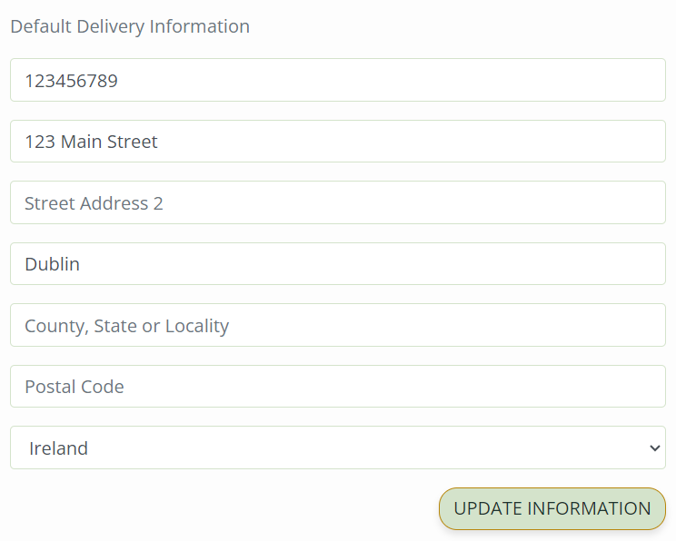
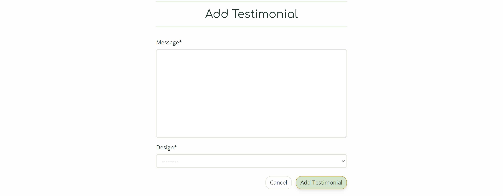
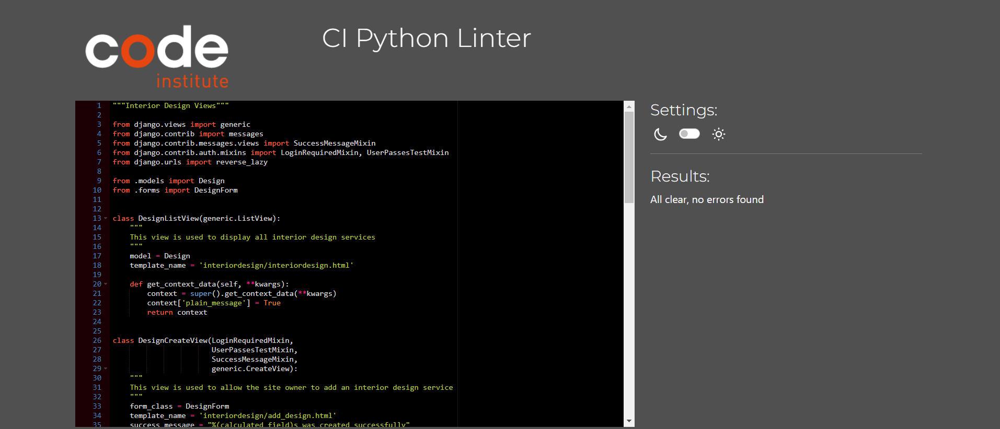

# Decor Dreams | Testing

This document provides an overview of the testing strategies applied throughout the development of the Decor Dreams store. It includes various types of testing to ensure functionality, compatibility, usability, and responsiveness of the application.

[Back to README.md](README.md)

---

## CONTENTS

- [Decor Dreams | Testing](#decor-dreams--testing)
  - [CONTENTS](#contents)
  - [User Story Testing](#user-story-testing)
      - [EPIC - Viewing and Navigation](#epic---viewing-and-navigation)
      - [EPIC - User Authentication](#epic---user-authentication)
      - [EPIC - Shop Products](#epic---shop-products)
      - [EPIC - Administration and Store Management](#epic---administration-and-store-management)
      - [EPIC - Design \& Planning](#epic---design--planning)
      - [EPIC - Marketing and SEO](#epic---marketing-and-seo)
  - [Site Administration](#site-administration)
  - [Code Validation](#code-validation)
    - [HTML](#html)
    - [CSS](#css)
    - [JavaScript](#javascript)
    - [Python](#python)
    - [Lighthouse](#lighthouse)
  - [Browser Testing](#browser-testing)
  - [Device Testing](#device-testing)
  - [Manual Testing](#manual-testing)
    - [Site Navigation](#site-navigation)
    - [Home Page](#home-page)
    - [All Auth Pages](#all-auth-pages)
    - [Shop Products](#shop-products)
    - [Product Details](#product-details)
    - [Products Management](#products-management)
    - [Bag](#bag)
    - [Checkout](#checkout)
    - [Profile](#profile)
    - [Interior Design Services](#interior-design-services)
    - [Interior Design Management](#interior-design-management)
    - [Decor Dreams Projects](#decor-dreams-projects)
    - [Decor Dreams Projects Management](#decor-dreams-projects-management)
    - [Testimonials](#testimonials)
    - [Testimonial Management](#testimonial-management)
    - [Contact](#contact)
    - [Consultation Dashboard](#consultation-dashboard)
  - [Bugs](#bugs)
    - [Solved Bugs](#solved-bugs)
---

## User Story Testing

#### EPIC - Viewing and Navigation

| User Story                                                                                                                                                                     | Screenshot                                                               |
|--------------------------------------------------------------------------------------------------------------------------------------------------------------------------------|--------------------------------------------------------------------------|
| *"As a Site User I want to be able to navigate intuitively around the site so that I can easily find the content I'm interested in."*                                       |           |
| *"As a Site User I want to be able to see a comprehensive list of products available so that I can choose what to explore further."*                                       |           |
| *"As a Shopper I want to be able to click on a product so that I can read the full product details."*                                       |           |
| *"As a Shopper I want to be able to view a specific category of products so that I can find what I like more easily and have a smoother time shopping."*                                       |           |
| *"As a Shopper I want to be able to search for products across the website so that I can easily find what I need."*                                       |       |
| *"As a Shopper I want to be able to arrange all products by price or title so that I can easily compare and view them."*                                       |       |
| *"As a Site User I want to be able to view a comprehensive list of interior design services provided so that I can understand the scope of each service and easily make an enquiry if I'm interested."*                                       |       |
| *"As a Site User I want to be able to access the testimonials left by other customers so that I can gauge the quality of the Interior Design Services they received."*                                       |       |
| *"As a Site User I want to be able to browse through pictures of previous Decor Dreams interior design projects so that I can assess the quality of work and develop trust in the service provider."*                                       |       |

#### EPIC - User Authentication

| User Story                                                                                                                                                                     | Screenshot                                                               |
|--------------------------------------------------------------------------------------------------------------------------------------------------------------------------------|--------------------------------------------------------------------------|
| *"As a Site User I want to be able to sign up so that I can have a personal account on Decor Dreams."*                                       |           |
| *"As a Site User I want to be able to log in or log out of my account so that I can keep my account secure."*                                       |           |
| *"As a Site User I want to be able to check my login status so that I can know if I'm logged in or out."*                                       |          |
| *"As a Site User I want to be able to access my order history so that I can recall my past purchases."*                                       |          |
| *"As a Site User I want to be able to save my personal details in my user profile so that I do not have to fill them out for future orders."*                                       |          |
| *"As a Site User I want to be able to recover my password if I forget it so that I can regain access to my account."*                                       |          |

#### EPIC - Shop Products

| User Story                                                                                                                                                                     | Screenshot                                                               |
|--------------------------------------------------------------------------------------------------------------------------------------------------------------------------------|--------------------------------------------------------------------------|
| *"As a Shopper I want to be able to add multiple products in varying quantities to my shopping bag so that I can purchase them all together when I'm ready."*                                       |           |
| *"As a Shopper I want to be able to see a running total of my shopping bag as I add items so that I can keep track of the total cost."*                                       |          |
| *"As a Shopper I want to be able to view a summary of my shopping cart during checkout so that I can review the included products and the total cost before finalizing my purchase."*                                       |           |
| *"As a Shopper I want to be able to modify the quantity of individual products in my shopping bag so that I can easily make changes before finalizing my purchase."*                                       |           |
| *"As a Shopper I want to be able to securely enter my payment information easily so that I can ensure a quick and hassle-free purchase process for my selected products."*                                       |           |
| *"As a Shopper I want to be able to view the contents of my shopping bag at any time so that I can review what items are included and the total cost."*                                       |           |
| *"As a Shopper I want to be able to checkout as a guest so that I can make a purchase without having to sign up for an account."*                                       |           |
| *"As a Shopper I want to be able to view an order confirmation after completing the checkout process so that I can ensure that my purchase was successful."*                                       |           |
| *"As a Shopper I want to be able to receive an email confirmation of my order so that I can have a record of my purchase."*                                       |          |

#### EPIC - Administration and Store Management

| User Story                                                                                                                                                                     | Screenshot                                                               |
|--------------------------------------------------------------------------------------------------------------------------------------------------------------------------------|--------------------------------------------------------------------------|
| *"As a Store Owner I want to be able to add, edit, and delete products using a user-friendly interface so that I can ensure smooth management of the store's contents."*                                       |            |
| *"As a Store Owner I want to be able to add, edit, and delete interior design services using a simple interface so that I can manage the site's content."*                                       |            |
| *"As a Store Owner I want to be able to add, edit, and delete images and locations of previous Decor Dreams design projects so that I can effectively manage the site's content."*                                       |            |
| *"As a Store Owner I want to be able to view and delete customer enquiries directly on the front-end so that I can manage them without having to access the admin panel."*                                       |            |

#### EPIC - Design & Planning

| User Story                                                                                                                                                                     | Screenshot                                                               |
|--------------------------------------------------------------------------------------------------------------------------------------------------------------------------------|--------------------------------------------------------------------------|
| *"As a Site User I want to be able to submit an enquiry form so that I can contact the site owner."*                                       |          |
| *"As a Site User I want to be able to add, edit, or delete a testimonial related to a consultation I received so that I can provide my feedback."*                                       |            |

#### EPIC - Marketing and SEO

| User Story                                                                                                                                                                     | Screenshot                                                               |
|--------------------------------------------------------------------------------------------------------------------------------------------------------------------------------|--------------------------------------------------------------------------|
| *"As a Site User I want to be able to sign up for the Decor Dreams' newsletter so that I can stay informed about new products and promotions."*                                       |          |
| *"As a Developer I want to be able to create a Facebook marketing promotional page to spotlight the Decor Dreams so that I can attract potential customers to the website."*                                       |          |

[Back to Contents](#contents)

---

## Site Administration

- Admins possess complete access to Create, Read, Update, and Delete (CRUD) functionalities for all products, categories, interior design services, Decor Dreams projects, testimonials, and users within the admin panel.

[Back to Contents](#contents)

---

## Code Validation

### HTML

I've used [HTML W3C Validator](https://validator.w3.org) to validate all of my HTML files.

| Page                           | Screenshot | Notes     |
|--------------------------------|------------|-----------|
| Home                           |   | Pass: No Errors |
| Products                       |   | Pass: No Errors |
| Product Details                |   | Pass: No Errors |
| Add Product                    |         | Pass: No Errors      |
| Edit Product                   |         | Pass: No Errors      |
| Confirm Delete Product         |         | Pass: No Errors |
| Bag                            |   | Pass: No Errors |
| Checkout                       |   | Pass: No Errors |
| Profile                        |         | Pass: No Errors |
| Search                         |         | Pass: No Errors |
| Interior Design Services       |   | Pass: No Errors |
| Add Interior Design Service    |         | Pass: No Errors      |
| Edit Interior Design Service   |         | Pass: No Errors      |
| Delete Interior Design Service |         | Pass: No Errors |
| Decor Dreams Projects          |   | Pass: No Errors |
| Add Decor Dreams Project       |         | Pass: No Errors      |
| Edit Decor Dreams Project      |   | Pass: No Errors |
| Delete Decor Dreams Project    |         | Pass: No Errors |
| Testimonials                   |   | Pass: No Errors |
| Add Testimonial                |         | Pass: No Errors |
| Edit Testimonial               |         | Pass: No Errors |
| Delete Testimonial             |         | Pass: No Errors |
| Contact                        |   | Pass: No Errors |
| Consultation Dashboard         |         | Pass: No Errors |
| Consultation Detail            |         | Pass: No Errors |
| Delete Consultation            |         | Pass: No Errors |
| Sign In                        |   | Pass: No Errors |
| Sign Up                        |   | Pass: No Errors |
| Log Out                        |         | Pass: No Errors |
| Password Reset                 |   | Pass: No Errors |

### CSS

No errors were found when passing my CSS files through the official [W3C CSS Validator](https://jigsaw.w3.org/css-validator/#validate_by_input)

| Page                           | Screenshot | Notes     |
|--------------------------------|------------|-----------|
| *base.css*                     |   | Pass: No Errors |
| *checkout.css*                 |   | Pass: No Errors |
| *profile.css*                  |   | Pass: No Errors |

### JavaScript

All Javascript was passed through [JSHint](https://jshint.com/) with no issues.

| File                           | Screenshot | Notes     |
|--------------------------------|------------|-----------|
| *base*                     |   | Pass: No Errors |
| *main nav*                     |   | Pass: No Errors |
| *products*                     |   | Pass: No Errors |
| *bag*                     |   | Pass: No Errors |
| *stripe elements*                     |   | Pass: No Errors |
| *image selector*                     |   | Pass: No Errors |
| *profile*                     |   | Pass: No Errors |

### Python

All Python files were run through [Code Institute Python Linter](https://pep8ci.herokuapp.com/#) and no errors were detected.

Below are observed the most relevant items.

**Bag**
| File                           | Screenshot | Notes     |
|--------------------------------|------------|-----------|
| *contexts.py*                     |   | Pass: No Errors |
| *views.py*                     |   | Pass: No Errors |

**Checkout**
| File                           | Screenshot | Notes     |
|--------------------------------|------------|-----------|
| *admin.py*                     |   | Pass: No Errors |
| *forms.py*                     |   | Pass: No Errors |
| *models.py*                     |   | Pass: No Errors |
| *signals.py*                     |   | Pass: No Errors |
| *views.py*                     |   | Pass: No Errors |
| *webhook handler.py*                     |   | Pass: No Errors |
| *webhooks.py*                     |   | Pass: No Errors |

**Contact**
| File                           | Screenshot | Notes     |
|--------------------------------|------------|-----------|
| *admin.py*                     |   | Pass: No Errors |
| *forms.py*                     |   | Pass: No Errors |
| *models.py*                     |   | Pass: No Errors |
| *views.py*                     |   | Pass: No Errors |

**Interior Design**
| File                           | Screenshot | Notes     |
|--------------------------------|------------|-----------|
| *admin.py*                     |   | Pass: No Errors |
| *forms.py*                     |   | Pass: No Errors |
| *models.py*                     |   | Pass: No Errors |
| *views.py*                     |   | Pass: No Errors |

**Products**
| File                           | Screenshot | Notes     |
|--------------------------------|------------|-----------|
| *admin.py*                     |   | Pass: No Errors |
| *forms.py*                     |   | Pass: No Errors |
| *models.py*                     |   | Pass: No Errors |
| *views.py*                     |   | Pass: No Errors |

**Profiles**
| File                           | Screenshot | Notes     |
|--------------------------------|------------|-----------|
| *forms.py*                     |   | Pass: No Errors |
| *models.py*                     |   | Pass: No Errors |
| *views.py*                     |   | Pass: No Errors |

**Projects**
| File                           | Screenshot | Notes     |
|--------------------------------|------------|-----------|
| *models.py*                     |   | Pass: No Errors |
| *views.py*                     |   | Pass: No Errors |

**Testimonials**
| File                           | Screenshot | Notes     |
|--------------------------------|------------|-----------|
| *models.py*                     |   | Pass: No Errors |
| *views.py*                     |   | Pass: No Errors |

### Lighthouse

I conducted Lighthouse validation on all pages, including both mobile and desktop versions, to assess accessibility and performance. Initially, a warning was flagged regarding 'Background and foreground colors do not have a sufficient contrast ratio' in some elements. I addressed this issue by modifying the colors, referencing the [WebAIM Contrast Checker](https://webaim.org/resources/contrastchecker/), to achieve the recommended Contrast Ratio. Subsequently, I implemented style adjustments based on Lighthouse recommendations, resulting in the following improved scores.

| Page                           | Performance  | Accessibility | Best Practices  | SEO |
|--------------------------------|:------------:|:-------------:|:---------------:|:---:|
|                                |              |               |                 |     |
| Desktop                        |              |               |                 |     |
| Home                           |           89 |            96 |             100 | 100 |
| Products                       |           94 |            98 |             100 | 100 |
| Product Details                |           98 |            98 |             100 | 100 |
| Add Product                    |           99 |           100 |             100 | 100 |
| Edit Product                   |           96 |           100 |             100 | 100 |
| Confirm Delete Product         |           97 |           100 |             100 | 100 |
| Bag                            |           98 |            98 |             100 | 100 |
| Checkout                       |           94 |            96 |             100 | 100 |
| Profile                        |           98 |           100 |             100 | 100 |
| Interior Design Services       |           99 |           100 |             100 | 100 |
| Add Interior Design Service    |           99 |           100 |             100 | 100 |
| Edit Interior Design Service   |           99 |           100 |             100 | 100 |
| Delete Interior Design Service |           99 |           100 |             100 | 100 |
| Decor Dreams Projects          |           99 |           100 |             100 | 100 |
| Add Decor Dreams Project       |           99 |           100 |             100 | 100 |
| Edit Decor Dreams Project      |           99 |           100 |             100 | 100 |
| Delete Decor Dreams Project    |           99 |           100 |             100 | 100 |
| Testimonials                   |           99 |            98 |             100 | 100 |
| Add Testimonial                |           99 |           100 |             100 | 100 |
| Edit Testimonial               |           99 |           100 |             100 | 100 |
| Delete Testimonial             |           99 |           100 |             100 | 100 |
| Contact                        |           99 |           100 |             100 | 100 |
| Consultation Dashboard         |           99 |           100 |             100 | 100 |
| Consultation Detail            |           99 |           100 |             100 | 100 |
| Delete Consultation            |           99 |           100 |             100 | 100 |
| Sign In                        |           99 |            98 |              98 | 100 |
| Sign Up                        |           99 |            98 |             100 | 100 |
| Log Out                        |           99 |           100 |             100 | 100 |
| Password Reset                 |           98 |           100 |             100 | 100 |

The Lighthouse audit has been instrumental in pinpointing areas where the site performs well and where improvements can be made. The areas identified for improvement, such as image optimization and resource minimization, are planned for future iterations of the site. The current focus has been to meet functionality requirements within a strict deadline, with performance optimizations slated for subsequent updates.

[Back to Contents](#contents)

---

## Browser Testing

- The Decor Dreams website was tested on Google Chrome, Firefox, and Safari browsers, with no issues noted.

[Back to Contents](#contents)

---

## Device Testing

- The Decor Dreams website was tested on a variety of devices, including Desktop, Laptop, iPhone 8, iPhone XR, and iPad, to ensure responsiveness across different screen sizes in both portrait and landscape modes. The website performed as intended, and the responsive design was checked using Chrome developer tools on multiple devices, maintaining structural integrity for various sizes.

[Back to Contents](#contents)

---

## Manual Testing

### Site Navigation

| Element                          | Action                        | Expected Result                                              | Pass/Fail |
|----------------------------------|-------------------------------|--------------------------------------------------------------|-----------|
| NavBar                           |                               |                                                              |           |
| Site Name (logo area)            | Click                         | Redirect to home                                             | Pass      |
| Search Box Function              | Enter Text and Click Search   | Search both the product's title and description for a match. | Pass      |
| My Account Dropdown              | Click                         | Open profile dropdown                                        | Pass      |
| Register Link                    | Click                         | Redirect to Sign Up page                                     | Pass      |
|                                  |                               | (Not visible if user in session)                             | Pass      |
| Sign in Link                     | Click                         | Redirect to Login page                                       | Pass      |
|                                  |                               | (Not visible if user in session)                             | Pass      |
| Add a Product Link       | Click                         | Redirect to add_product page                                 | Pass      |
|                                  |                               | (Only visible if superuser in session)                       | Pass      |
| Add a Interior Design Service Link   | Click                         | Redirect to add_service page                                 | Pass      |
|                                  |                               | (Only visible if superuser in session)                       | Pass      |
| Add a Decor Dreams Project Management Link | Click                         | Redirect to add_project page                           | Pass      |
|                                  |                               | (Only visible if superuser in session)                       | Pass      |
| Check Consultations Link                   | Click                         | Redirect to consultations_dashboard page                         | Pass      |
|                                  |                               | (Only visible if superuser in session)                       | Pass      |
| My Profile Link                  | Click                         | Redirect to user profile page                                | Pass      |
|                                  |                               | (Only visible if user in session)                            | Pass      |
| Sign out Link                      | Click                         | Redirect to logout confirm page                              | Pass      |
|                                  |                               | (Only visible if user in session)                            | Pass      |
| Bag Link                         | Click                         | Redirect to bag page                                         | Pass      |
|                                  |                               |                                                              |           |
| Mobile Top Header                |                               |                                                              |           |
| Search Icon Button               | Click                         | Open up search box                                           | Pass      |
| Search Box Function              | Enter Text and Click Search   | Search both the product's title and description for a match. | Pass      |
| My Account Dropdown              | Click                         | Open profile dropdown                                        | Pass      |
| Register Link                      | Click                         | Redirect to Sign Up page                                     | Pass      |
|                                  |                               | (Not visible if user in session)                             | Pass      |
| Sign in Link                       | Click                         | Redirect to login page                                       | Pass      |
|                                  |                               | (Not visible if user in session)                             | Pass      |
| Add a Product Link       | Click                         | Redirect to add_product page                                 | Pass      |
|                                  |                               | (Only visible if superuser in session)                       | Pass      |
| Add a Interior Design Service Link   | Click                         | Redirect to add_service page                                 | Pass      |
|                                  |                               | (Only visible if superuser in session)                       | Pass      |
| Add a Decor Dreams Project Management Link | Click                         | Redirect to add_project_image page                           | Pass      |
|                                  |                               | (Only visible if superuser in session)                       | Pass      |
| Check Consultations Link                   | Click                         | Redirect to enquiries_dashboard page                         | Pass      |
|                                  |                               | (Only visible if superuser in session)                       | Pass      |
| My Profile Link                  | Click                         | Redirect to user profile page                                | Pass      |
|                                  |                               | (Only visible if user in session)                            | Pass      |
| Sign out Link                      | Click                         | Redirect to logout confirm page                              | Pass      |
|                                  |                               | (Only visible if user in session)                            | Pass      |
| Bag Link                         | Click                         | Redirect to bag page                                         | Pass      |
|                                  |                               |                                                              |           |
| Main Nav                         |                               |                                                              |           |
| Shop Products Dropdown              | Click                         | Open Shop products dropdown                                     | Pass      |
| All Products Link                         | Click                         | Redirect all products page                                   | Pass      |
| Sofas Link                       | Click                         | Redirect to prints page filtered to Sofas                    | Pass      |
| Tables & Desks Link                      | Click                         | Redirect to prints page filtered to Tables & Desks                   | Pass      |
| Chairs Link                      | Click                         | Redirect to prints page filtered to Chairs                   | Pass      |
| Outdoor Living Link                    | Click                         | Redirect to prints page filtered to Outdoor Living                 | Pass      |
| Decoration Link                    | Click                         | Redirect to prints page filtered to Decoration                 | Pass      |
| Interior Design Link    | Click                         | Open Interior Design Services Page                           | Pass      |
| Decor Dreams Projects Link    | Click                         | Open Decor Dreams Projects Page                           | Pass      |
| Testimonials Link                | Click                         | Open Testimonials Page                                       | Pass      |
| Contact Us Link                     | Click                         | Open Contact Page                                            | Pass      |
| Hamburger Menu                   | Responsive                    | Display when screen size reduces to medium size              | Pass      |
| Home Link                        | Click                         | Redirect to home                                             | Pass      |
|                                  |                               | (Only displays when screen size reduces to medium size)       | Pass      |
| Footer                           |                               |                                                              |           |
| Newsletter Email field           | Insert incorrect/empty format | On submit: form won't submit                                 | Pass      |
| Newsletter Email field           | Insert incorrect/empty format | Error message displays                                       | Pass      |
| Subscribe Button                 | Click                         | Form submit                                                  | Pass      |
| Subscribe Button                 | Click                         | Message appears saying Thank You for subscribing!            | Pass      |
| Facebook Link          | Click                         | Open correct location in new tab                             | Pass      |
| Shop Products Link                  | Click                         | Open Shop Products Page                                         | Pass      |
| Interior Design Services Link    | Click                         | Open Interior Design Services Page                           | Pass      |
| Decor Dreams Projects Link    | Click                         | Open Decor Dreams Projects Page                           | Pass      |
| Testimonials Link         | Click                         | Open Testimonials Page                                       | Pass      |
| Contact Us Link                     | Click                         | Open Contact Page                                            | Pass      |
| Privacy Policy Link              | Click                         | Open Privacy Policy Page in new tab                          | Pass      |

### Home Page

| Element                | Action | Expected Result                    | Pass/Fail |
|------------------------|--------|------------------------------------|-----------|
| Shop Now Button        | Click  | Open Shop Products Page               | Pass      |
| Schedule a Consultation Button | Click  | Open Interior Design Services Page | Pass      |

### All Auth Pages 

| Element                         | Action                                    | Expected Result                              | Pass/Fail |
|---------------------------------|-------------------------------------------|----------------------------------------------|-----------|
| Sign Up                         |                                           |                                              |           |
| Sign in link                    | Click                                     | Redirect to sign in page                     | Pass      |
| Email field                     | Insert incorrect format                   | On submit: form won't submit                 | Pass      |
| Email field                     | Insert incorrect format                   | Error message displays                       | Pass      |
| Email field                     | Insert correct format                     | On submit: form submit                       | Pass      |
| Email field                     | Leave empty                               | On submit: form won't submit                 | Pass      |
| Email field                     | Insert duplicate email                    | On submit: form won't submit                 | Pass      |
| Email field                     | Insert duplicate email                    | Error message displays                       | Pass      |
| Email Confirmation field        | Insert different email                    | On submit: form won't submit                 | Pass      |
| Email Confirmation field        | Insert different email                    | Error message displays                       | Pass      |
| Username field                  | Leave empty/incorrect format              | On submit: form won't submit                 | Pass      |
| Username field                  | Leave empty/incorrect format              | Error message displays                       | Pass      |
| Username field                  | Insert correct format                     | On submit: form submit                       | Pass      |
| Username field                  | Insert duplicate username                 | On submit: form won't submit                 | Pass      |
| Username field                  | Insert duplicate username                 | Error message displays                       | Pass      |
| Password field                  | Insert incorrect format/length            | On submit: form won't submit                 | Pass      |
| Password field                  | Insert incorrect format/length            | Error message displays                       | Pass      |
| Password field                  | Passwords don't match                     | On submit: form won't submit                 | Pass      |
| Password field                  | Passwords don't match                     | Error message displays                       | Pass      |
| Password field                  | Insert correct format and passwords match | On submit: form submit                       | Pass      |
| Sign Up button(form valid)      | Click                                     | Form submit                                  | Pass      |
| Sign Up button(form valid)      | Click                                     | Redirect to Verify Email Address page        | Pass      |
| Sign Up button(form valid)      | Click                                     | Alert message confirming email sent appears  | Pass      |
| Confirmation Email Confirm Link | Click                                     | Open Confirm Email Address Page              | Pass      |
| Confirm Button                  | Click                                     | Success message confirming new user appears  | Pass      |
| Confirm Button                  | Click                                     | Redirect to sign in page                     | Pass      |
|                                 |                                           |                                              |           |
| Log in                          |                                           |                                              |           |
| Sign up link                    | Click                                     | Redirect to sign up page                     | Pass      |
| Username field                  | Leave empty                               | On submit: form won't submit                 | Pass      |
| Username field                  | Leave empty                               | Error message displays                       | Pass      |
| Username field                  | Insert wrong username                     | On submit: form won't submit                 | Pass      |
| Username field                  | Insert wrong username                     | Error message displays                       | Pass      |
| Password field                  | Leave empty                               | On submit: form won't submit                 | Pass      |
| Password field                  | Leave empty                               | Error message displays                       | Pass      |
| Password field                  | Insert wrong password                     | On submit: form won't submit                 | Pass      |
| Password field                  | Insert wrong password                     | Error message displays                       | Pass      |
| Login button(form valid)        | Click                                     | Form submit                                  | Pass      |
| Login button(form valid)        | Click                                     | Redirect to home page                        | Pass      |
| Login button(form valid)        | Click                                     | Success message confirming login appears     | Pass      |
| Forgot Password Link            | Click                                     | Redirect to Password Reset page              | Pass      |
| Email field                     | Leave empty/incorrect format              | On submit: form submit                       | Pass      |
| Reset My Password Button        | Click                                     | Confirmation message that email sent         | Pass      |
| Password Reset Email Link       | Click                                     | Open Change Password Page                    | Pass      |
| Change Password Button          | Click                                     | Success message confirming Password Changed  | Pass      |
|                                 |                                           |                                              |           |
| Sign Out Confirmation           |                                           |                                              |           |
| Sign Out  button                | Click                                     | Redirect to homepage                         | Pass      |
| Sign Out  button                | Click                                     | Success message confirming Sign Out  appears | Pass      |

### Shop Products

| Element                         | Action  | Expected Result                                                                                | Pass/Fail |
|---------------------------------|---------|------------------------------------------------------------------------------------------------|-----------|
| Sort By' Dropdown               | Click   | Open 'sort by' options                                                                         | Pass      |
| Sort By' Options (x3)           | Click   | Re-order products correctly                                                                    | Pass      |
| If Category Selected            | Display | Pages heading changes to show category name                                                    | Pass      |
| Product Number                  | Display | Displays correct number of products on page                                                    | Pass      |
| Product Card                    | Hover   | Change card opacity                                                                            | Pass      |
| Product Card                    | Click   | Redirect to product detail page                                                                | Pass      |
| If Searched Product             | Display | Only display products with search term in either the product's title or description or excerpt | Pass      |
| If Searched Product             | Display | Display number of products found for " searched product"                                       | Pass      |
| If Superuser in session:        |         |                                                                                                |           |
| Add New Product Button          | Click   | Redirect to add product page                                                                   | Pass      |
| Edit product link               | Click   | Redirect to edit product page                                                                  | Pass      |
| Delete product link             | Click   | Open delete confirmation  page                                                                 | Pass      |
| Confirm Delete -  cancel button | Click   | Redirect to home decor page                                                                    | Pass      |
| Confirm Delete -  delete button | Click   | Delete product                                                                                 | Pass      |
| Confirm Delete -  delete button | Click   | Success message appears confirming product deleted successfully                                | Pass      |

### Product Details

| Element                  | Action                    | Expected Result                                                                              | Pass/Fail |
|--------------------------|---------------------------|----------------------------------------------------------------------------------------------|-----------|
| Product Content          | Display                   | Display correct product image, price, and product details       | Pass      |
| Qty control buttons      | Click                     | Increase/decrease quantity                                                                   | Pass      |
| Qty control buttons      | Click                     | Minus button disabled if quantity is 1                                                       | Pass      |
| Qty control buttons      | Click                     | Plus button disabled if quantity is 99                                                       | Pass      |
| Qty control buttons      | Manually Input  <1 or >99 | If quantity >99 or <1 manually entered, error message appears when Add to Bag button clicked | Pass      |
| Keep Shopping button     | Click                     | Redirect to home decor page                                                                  | Pass      |
| Add to bag button        | Click                     | Add item to bag                                                                              | Pass      |
| Add to bag button        | Click                     | Toast Success appears                                                                        | Pass      |
| Add to bag button        | Click                     | Product and quantity visible in toast success                                                | Pass      |
| If Superuser in session: |                           |                                                                                              |           |
| Edit product link        | Click                     | Redirect to edit product page                                                                | Pass      |
| Delete product link      | Click                     | Open delete confirmation  page                                                               | Pass      |

### Products Management 

| Element                         | Action                | Expected Result                                                                                                            | Pass/Fail |
|---------------------------------|-----------------------|----------------------------------------------------------------------------------------------------------------------------|-----------|
| Add Product                     | Access                | If a user tries to add a product (by changing the url) without being signed in they are redirected to the login page       | Pass      |
| Add Product                     | Access                | If a user tries to add a product (by changing the url) without being superuser they are redirected to a custom 403 page    | Pass      |
| Form Text Input (if required)   | Leave blank           | On Submit: Warning appears, form won't submit                                                                              | Pass      |
| Form Text Input (if required)   | Just input whitespace | On Submit: Form won't submit                                                                                               | Pass      |
| SKU                             | Duplicate Entry       | On Submit: Warning appears, form won't submit                                                                              | Pass      |
| Form image select button        | Click                 | Open device storage                                                                                                        | Pass      |
| Form image select button        | Display               | Chosen image name displayed once selected                                                                                  | Pass      |
| Form image select button        | Display               | Default image is used if no image is selected                                                                              | Pass      |
| Cancel button                   | Click                 | Redirect to Home Decor page                                                                                                | Pass      |
| Add Product button(form valid)  | Click                 | Form submit                                                                                                                | Pass      |
| Add Product button(form valid)  | Click                 | Redirect to Product detail page for new product with all information displaying correctly                                  | Pass      |
| Add Product button(form valid)  | Click                 | Success message appears informing the superuser that the product has been added                                            | Pass      |
|                                 |                       |                                                                                                                            |           |
|                                 |                       |                                                                                                                            |           |
| Edit Product                    |                       |                                                                                                                            |           |
| Element                         | Action                | Expected Result                                                                                                            | Pass/Fail |
| Edit Product                    | Access                | If a user tries to add a product (by changing the url) without being signed in they are redirected to the login page       | Pass      |
| Edit Product                    | Access                | If a user tries to add a product (by changing the url) without being superuser they are redirected to a custom 403 page    | Pass      |
| Edit Product Form               | Display               | Form has all the fields filled out with the original content                                                               | Pass      |
| Edit Product Form               | Image Field           | Thumbnail of original image is shown                                                                                       | Pass      |
| Form Text Input (if required)   | Leave blank           | On Submit: Warning appears, form won't submit                                                                              | Pass      |
| Form Text Input (if required)   | Just input whitespace | On Submit: Form won't submit                                                                                               | Pass      |
| Cancel button                   | Click                 | Redirect to Home Decor page                                                                                                | Pass      |
| Submit button(form valid)       | Click                 | Form submit                                                                                                                | Pass      |
| Edit Product button(form valid) | Click                 | Redirect to Product detail page for new product with all information displaying correctly                                  | Pass      |
| Edit Product button(form valid) | Click                 | Success message appears informing the superuser that the product has been updated                                          | Pass      |
|                                 |                       |                                                                                                                            |           |
| Confirm Delete Product          | Action                | Expected Result                                                                                                            | Pass/Fail |
| Delete Product                  | Access                | If a user tries to Delete a product (by changing the url) without being signed in they are redirected to the login page    | Pass      |
| Delete Product                  | Access                | If a user tries to Delete a product (by changing the url) without being superuser they are redirected to a custom 403 page | Pass      |
| Confirm Delete -  cancel button | Click                 | Redirect to home decor page                                                                                                | Pass      |
| Confirm Delete -  delete button | Click                 | Delete product                                                                                                             | Pass      |
| Confirm Delete -  delete button | Click                 | Success message appears confirming product deleted successfully                                                            | Pass      |

### Bag

| Element                                                       | Action              | Expected Result                                        | Pass/Fail |
|---------------------------------------------------------------|---------------------|--------------------------------------------------------|-----------|
| No Bag Items                                                  |                     |                                                        |           |
| Keep Shopping button                                          | Click               | Redirect to shop products page                            | Pass      |
| Bag Items                                                     |                     |                                                        |           |
| Qty control buttons                                           | Click               | Increase/decrease quantity                             | Pass      |
| Qty control buttons                                           | Click               | Minus button disabled if quantity is 1                 | Pass      |
| Qty control buttons                                           | Click               | Plus button disabled if quantity is 99                 | Pass      |
| Qty control buttons                                           | Manually Input  >99 | Error message appears when refresh button is clicked   | Pass      |
| Qty control buttons                                           | Manually Input  <1  | Shopping bag is emptied when refresh button is clicked | Pass      |
| Refresh Icon button                                           | Click               | Update bag item quantity                               | Pass      |
| Refresh Icon button                                           | Refresh Icon button | Updated confirmation toast appears                     | Pass      |
| Bin Icon button                                               | Click               | Remove item from bag                                   | Pass      |
| Bin Icon button                                               | Click               | Removed confirmation toast appears                     | Pass      |
| Line item subtotal / Bag total / Delivery cost / Grand Total  | Calculate           | All numbers are calculated correctly                   | Pass      |
| Continue shopping button                                      | Click               | Redirect to products page                              | Pass      |
| Secure Checkout button                                        | Click               | Redirect to checkout page                              | Pass      |

### Checkout

| Element                             | Action                          | Expected Result                                                     | Pass/Fail |
|-------------------------------------|---------------------------------|---------------------------------------------------------------------|-----------|
| Checkout Page                       | Direct URL input (empty bag)    | redirect to products page                                           | Pass      |
| Checkout Page                       | Direct URL input (empty bag)    | empty bag toast appears                                             | Pass      |
| Form fields(if user logged in)      | On load                         | fields populated with user default info(if previously saved)        | Pass      |
| Text Input(if required)             | Leave blank                     | On submit:form won't submit                                         | Pass      |
| Text Input(if required)             | Leave blank                     | error message on invalid field(s)                                   | Pass      |
| Text Input(if required)             | Just whitespace                 | On submit:form won't submit                                         | Pass      |
| Text Input(if required)             | Just whitespace                 | error message on invalid field(s)                                   | Pass      |
| Text Input(if required)             | Fill in correctly               | On submit: form submits                                             | Pass      |
| Phone number Input                  | Leave blank                     | On submit:form won't submit                                         | Pass      |
| Phone number Input                  | Leave blank                     | error message on field                                              | Pass      |
| Phone number Input                  | Just whitespace                 | On submit:form won't submit                                         | Pass      |
| Phone number Input                  | Just whitespace                 | error message on field                                              | Pass      |
| Phone number Input                  | Use non numeric characters      | On submit:form won't submit                                         | Pass      |
| Phone number Input                  | Use non numeric characters      | error message on field                                              | Pass      |
| Email Input                         | Leave blank                     | On submit:form won't submit                                         | Pass      |
| Email Input                         | Leave blank                     | error message on field                                              | Pass      |
| Email Input                         | Just whitespace                 | On submit:form won't submit                                         | Pass      |
| Email Input                         | Just whitespace                 | error message on field                                              | Pass      |
| Email Input                         | Fill in correctly               | On submit: form submits                                             | Pass      |
| Form Dropdown                       | Click                           | Show dropdown options                                               | Pass      |
| Save to profile checkbox            | On load(user logged in)         | Shown                                                               | Pass      |
| Save to profile checkbox            | On load(user not logged in)     | Not shown                                                           | Pass      |
| Save to profile checkbox            | Checked                         | On submit:Delivery information saved to user profile                | Pass      |
| Save to profile checkbox            | Unchecked                       | On submit:Delivery information not saved to user profile            | Pass      |
| Payment card input                  | Input invalid card number       | Error message on field                                              | Pass      |
| Payment card input                  | Input invalid date              | Error message on field                                              |           |
| Adjust Bag button                   | Click                           | Redirect to bag page                                                | Pass      |
| Complete Order button(form invalid) | Click                           | Form won't submit                                                   | Pass      |
| Complete Order button(form invalid) | Click                           | Error message on invalid fields                                     | Pass      |
| Complete Order button(form valid)   | Payment succeeds                | loading screen reappears                                            | Pass      |
| Complete Order button(form valid)   | Payment succeeds                | form submits                                                        | Pass      |
| Complete Order button(form valid)   | Payment succeeds                | redirect to order confirmation page                                 | Pass      |
| Complete Order button(form valid)   | (if user logged in)             | order saved to user profile                                         | Pass      |
| Complete Order button(form valid)   | Payment failed                  | Loading animation appears                                           | Pass      |
| Complete Order button(form valid)   | Payment failed                  | form won't submit                                                   | Pass      |
| Complete Order button(form valid)   | Payment failed                  | error message at bottom of form                                     | Pass      |
| Complete Order button(form valid)   | Click                           | Success message appears confirming order successfully processed     | Pass      |
| Complete Order button(form valid)   | Payment Requires authentication | Authentication box appears                                          | Pass      |
| Fail Authentication button          | Click                           | Authentication box closes                                           | Pass      |
| Fail Authentication button          | Click                           | User directed back to form                                          | Pass      |
| Fail Authentication button          | Click                           | error message at bottom of form                                     | Pass      |
| Complete Authentication button      | Click                           | loading screen reappears                                            | Pass      |
| Complete Authentication button      | Click                           | form submits                                                        | Pass      |
| Complete Authentication button      | Click                           | redirect to order confirmation page                                 | Pass      |
| Complete Order button(form valid)   | Click                           | Success message appears confirming order successfully processed     | Pass      |
| Complete Order button(form valid)   | Click                           | User receives an order confirmation email with correct information  | Pass      |
|                                     |                                 |                                                                     |           |
| Checkout Success Page               |                                 |                                                                     |           |
| Element                             | Action                          | Expected Result                                                     | Pass/Fail |
| Order Confirmation                  | Display                         | Display Correct Order Details                                       | Pass      |
| Keep Shopping! button               | Click                           | Redirect to products page                                           | Pass      |

### Profile

| Element                | Action            | Expected Result                                                                                                                | Pass/Fail |
|------------------------|-------------------|--------------------------------------------------------------------------------------------------------------------------------|-----------|
| Open Profile Page      | Access            | If a user tries to access the profile page (by changing the url) without being signed in they are redirected to the login page | Pass      |
| Form fields            | On load           | fields populated with user default info(if previously saved)                                                                   | Pass      |
| All input fields       | Leave blank       | On submit: form submits                                                                                                        | Pass      |
| All input fields       | Just whitespace   | On submit: form submits                                                                                                        | Pass      |
| All input fields       | Fill in correctly | On submit: form submits                                                                                                        | Pass      |
| Form Dropdown          | Click             | Show dropdown options                                                                                                          | Pass      |
| Update button          | Click             | Form submits                                                                                                                   | Pass      |
| Update button          | Click             | Success message appears confirming profile successfully updated                                                                | Pass      |
| Previous order number  | Click             | Redirect to previous order page                                                                                                | Pass      |
|                        |                   |                                                                                                                                |           |
| Previous Order Page    |                   |                                                                                                                                |           |
| Element                | Action            | Expected Result                                                                                                                | Pass/Fail |
| Information Display    | Display           | All previous order information displays correctly                                                                              | Pass      |
| Toast                  | On load           | Previous order info toast appears                                                                                              | Pass      |
| Back to Profile button | Click             | Redirect to profile page                                                                                                       | Pass      |

### Interior Design Services

| Element                  | Action  | Expected Result                                 | Pass/Fail |
|--------------------------|---------|-------------------------------------------------|-----------|
| Service Content          | Display | Display correct service image, type and content | Pass      |
| Schedule a consultation Now button       | Click   | Open Contact page                               | Pass      |
| If Superuser in session: |         |                                                 |           |
| Add service link        | Click   | Redirect to add service page                   | Pass      |
| Edit service link        | Click   | Redirect to edit service page                   | Pass      |
| Delete service link      | Click   | Open delete confirmation  page                  | Pass      |

### Interior Design Management

| Add Service                     |                       |                                                                                                                            |           |
|---------------------------------|-----------------------|----------------------------------------------------------------------------------------------------------------------------|-----------|
| Element                         | Action                | Expected Result                                                                                                            | Pass/Fail |
| Add Service                     | Access                | If a user tries to add a service (by changing the url) without being signed in they are redirected to the login page       | Pass      |
| Add Service                     | Access                | If a user tries to add a service (by changing the url) without being superuser they are redirected to a custom 403 page    | Pass      |
| Form Text Input (if required)   | Leave blank           | On Submit: Warning appears, form won't submit                                                                              | Pass      |
| Form Text Input (if required)   | Just input whitespace | On Submit: Form won't submit                                                                                               | Pass      |
| Form image select button        | Click                 | Open device storage                                                                                                        | Pass      |
| Form image select button        | Display               | Chosen image name displayed once selected                                                                                  | Pass      |
| Form image select button        | Display               | Default image is used if no image is selected                                                                              | Pass      |
| Cancel button                   | Click                 | Redirect to Interior Design Services page                                                                                  | Pass      |
| Add Service button(form valid)  | Click                 | Form submit                                                                                                                | Pass      |
| Add Service button(form valid)  | Click                 | Redirect to Interior Design Services Page with all information displaying correctly                                        | Pass      |
| Add Service button(form valid)  | Click                 | Success message appears informing the superuser that the service has been added                                            | Pass      |
|                                 |                       |                                                                                                                            |           |
| Edit Service                    |                       |                                                                                                                            |           |
| Element                         | Action                | Expected Result                                                                                                            | Pass/Fail |
| Edit Service                    | Access                | If a user tries to edit a service (by changing the url) without being signed in they are redirected to the login page      | Pass      |
| Edit Service                    | Access                | If a user tries to edit a service (by changing the url) without being superuser they are redirected to a custom 403 page   | Pass      |
| Edit Service Form               | Display               | Form has all the fields filled out with the original content                                                               | Pass      |
| Edit Service Form               | Image Field           | Thumbnail of original image is shown                                                                                       | Pass      |
| Form Text Input (if required)   | Leave blank           | On Submit: Warning appears, form won't submit                                                                              | Pass      |
| Form Text Input (if required)   | Just input whitespace | On Submit: Form won't submit                                                                                               | Pass      |
| Cancel button                   | Click                 | Redirect to Interior Design Services page                                                                                  |           |
| Submit button(form valid)       | Click                 | Form submit                                                                                                                | Pass      |
| Edit Service button(form valid) | Click                 | Redirect to Interior Design Services Page with all information displaying correctly                                        | Pass      |
| Edit Service button(form valid) | Click                 | Success message appears informing the superuser that the service has been edited                                           | Pass      |
|                                 |                       |                                                                                                                            |           |
| Confirm Delete Service          |                       |                                                                                                                            |           |
| Element                         | Action                | Expected Result                                                                                                            | Pass/Fail |
| Delete Service                  | Access                | If a user tries to Delete a service (by changing the url) without being signed in they are redirected to the login page    | Pass      |
| Delete Service                  | Access                | If a user tries to Delete a service (by changing the url) without being superuser they are redirected to a custom 403 page | Pass      |
| Confirm Delete -  cancel button | Click                 | Redirect to Interior Design Services page                                                                                  | Pass      |
| Confirm Delete -  delete button | Click                 | Delete Service from database                                                                                               | Pass      |
| Confirm Delete -  delete button | Click                 | Success message appears confirming service deleted successfully                                                            | Pass      |

### Decor Dreams Projects

| Element                  | Action  | Expected Result                           | Pass/Fail |
|--------------------------|---------|-------------------------------------------|-----------|
| Decor Dreams Content | Display | Display correct image and location        | Pass      |
| Project Card             | Hover   | Display Service Type and Project location | Pass      |
| If Superuser in session: |         |                                           |           |
| Add a Decor Dreams Project button    | Display | Below the title               | Pass      |
| Add a Decor Dreams Project button    | Click   | Open add a Decor Dreams Project page            | Pass      |
| Edit project button    | Display | In top right corner of image              | Pass      |
| Edit project button    | Click   | Open edit a Decor Dreams page            | Pass      |
| Delete project button    | Display | In top right corner of image              | Pass      |
| Delete project button    | Click   | Open delete confirmation page            | Pass      |

### Decor Dreams Projects Management

| Add Decor Dreams Project            |                       |                                                                                                                            |           |
|---------------------------------|-----------------------|----------------------------------------------------------------------------------------------------------------------------|-----------|
| Element                         | Action                | Expected Result                                                                                                            | Pass/Fail |
| Add Decor Dreams Project            | Access                | If a user tries to add a project (by changing the url) without being signed in they are redirected to the login page       | Pass      |
| Add Decor Dreams Project            | Access                | If a user tries to add a project (by changing the url) without being superuser they are redirected to a custom 403 page    | Pass      |
| Form Text Input (if required)   | Leave blank           | On Submit: Warning appears, form won't submit                                                                              | Pass      |
| Form Text Input (if required)   | Just input whitespace | On Submit: Form won't submit                                                                                               | Pass      |
| Service Dropdown                | Click                 | Display all Interior Design Services in Database                                                                           | Pass      |
| Form image select button        | Click                 | Open device storage                                                                                                        | Pass      |
| Form image select button        | Display               | Chosen image name displayed once selected                                                                                  | Pass      |
| Form image select button        | Leave blank           | On Submit: Warning appears, form won't submit                                                                              | Pass      |
| Cancel button                   | Click                 | Redirect to Interior Design Projects page                                                                                  | Pass      |
| Add Project button(form valid)  | Click                 | Form submit                                                                                                                | Pass      |
| Add Project button(form valid)  | Click                 | Redirect to Interior Design Projects Page with all information displaying correctly                                        | Pass      |
| Add Project button(form valid)  | Click                 | Success message appears informing the superuser that the project has been added                                            | Pass      |
|                                 |                       |                                                                                                                            |           |
| Edit Decor Dreams Project                    |                       |                                                                                                                            |           |
| Element                         | Action                | Expected Result                                                                                                            | Pass/Fail |
| Edit Decor Dreams Project                    | Access                | If a user tries to edit a Decor Dreams Project (by changing the url) without being signed in they are redirected to the login page      | Pass      |
| Edit Decor Dreams Project                    | Access                | If a user tries to edit a Decor Dreams Project (by changing the url) without being superuser they are redirected to a custom 403 page   | Pass      |
| Edit Decor Dreams Project Form               | Display               | Form has all the fields filled out with the original content                                                               | Pass      |
| Edit Decor Dreams Project Form               | Image Field           | Thumbnail of original image is shown                                                                                       | Pass      |
| Form Text Input (if required)   | Leave blank           | On Submit: Warning appears, form won't submit                                                                              | Pass      |
| Form Text Input (if required)   | Just input whitespace | On Submit: Form won't submit                                                                                               | Pass      |
| Cancel button                   | Click                 | Redirect to Decor Dreams Project page                                                                                  |           |
| Submit button(form valid)       | Click                 | Form submit                                                                                                                | Pass      |
| Edit Service button(form valid) | Click                 | Redirect to Decor Dreams Project Page with all information displaying correctly                                        | Pass      |
| Edit Service button(form valid) | Click                 | Success message appears informing the superuser that the service has been edited                                           | Pass      |
|                                 |                       |                                                                                                                            |           |
| Confirm Delete Project Image    |                       |                                                                                                                            |           |
| Element                         | Action                | Expected Result                                                                                                            | Pass/Fail |
| Delete Decor Dreams Project         | Access                | If a user tries to delete a project (by changing the url) without being signed in they are redirected to the login page    | Pass      |
| Delete Decor Dreams Project         | Access                | If a user tries to delete a project (by changing the url) without being superuser they are redirected to a custom 403 page | Pass      |
| Confirm Delete -  cancel button | Click                 | Redirect to Interior Design Projects page                                                                                  | Pass      |
| Confirm Delete -  delete button | Click                 | Delete Interior Design Projects  from database                                                                             | Pass      |
| Confirm Delete -  delete button | Click                 | Success message appears confirming Interior Design Projects  deleted successfully                                          | Pass      |

### Testimonials

| Element                 | Action  | Expected Result                                                                    | Pass/Fail |
|-------------------------|---------|------------------------------------------------------------------------------------|-----------|
| Testimonial Content     | Display | Display correct testimonial content, service type, author and date                 | Pass      |
| Add Testimonial button  | Click   | Open Add testimonial form                                                          | Pass      |
| Edit testimonial link   | Display | Only display if user is the author of the testimonial or if they are the superuser | Pass      |
| Edit testimonial link   | Click   | Redirect to edit testimonial page                                                  | Pass      |
| Delete Testimonial link | Display | Only display if user is the author of the testimonial                              | Pass      |
| Delete service link     | Click   | Open delete confirmation  page                                                     | Pass      |

### Testimonial Management

| Add Testimonial                     |                       |                                                                                                                             |           |
|-------------------------------------|-----------------------|-----------------------------------------------------------------------------------------------------------------------------|-----------|
| Element                             | Action                | Expected Result                                                                                                             | Pass/Fail |
| Add Testimonial                     | Access                | If a user tries to add a testimonial (by changing the url) without being signed in they are redirected to the login page    | Pass      |
| Form Text Input (if required)       | Leave blank           | On Submit: Warning appears, form won't submit                                                                               | Pass      |
| Form Text Input (if required)       | Just input whitespace | On Submit: Form won't submit                                                                                                | Pass      |
| Service Dropdown                    | Click                 | Display all Interior Design Services in Database                                                                            | Pass      |
| Cancel button                       | Click                 | Redirect to Testimonials page                                                                                               |           |
| Add Testimonial button(form valid)  | Click                 | Form submit                                                                                                                 | Pass      |
| Add Testimonial button(form valid)  | Click                 | Redirect to Testimonials Page with all information displaying correctly                                                     | Pass      |
| Add Testimonial button(form valid)  | Click                 | Success message appears informing the superuser that the testimonial has been added                                         | Pass      |
|                                     |                       |                                                                                                                             |           |
|                                     |                       |                                                                                                                             |           |
| Edit Testimonial                    |                       |                                                                                                                             |           |
| Element                             | Action                | Expected Result                                                                                                             | Pass/Fail |
| Edit Testimonial                    | Access                | If a user tries to edit a Testimonial (by changing the url) without being signed in they are redirected to the login page   | Pass      |
| Edit Testimonial                    | Access                | If a user tries to edit another user's Testimonial (by changing the url) they are redirected to a custom 403 page           | Pass      |
| Edit Testimonial Form               | Display               | Form has all the fields filled out with the original content                                                                | Pass      |
| Form Text Input (if required)       | Leave blank           | On Submit: Warning appears, form won't submit                                                                               | Pass      |
| Form Text Input (if required)       | Just input whitespace | On Submit: Form won't submit                                                                                                | Pass      |
| Cancel button                       | Click                 | Redirect to Testimonials page                                                                                               |           |
| Submit button(form valid)           | Click                 | Form submit                                                                                                                 | Pass      |
| Edit Testimonial button(form valid) | Click                 | Redirect to Testimonials Page with all information displaying correctly                                                     | Pass      |
| Edit Testimonial button(form valid) | Click                 | Success message appears informing the superuser that the testimonial has been edited                                        | Pass      |
|                                     |                       |                                                                                                                             |           |
|                                     |                       |                                                                                                                             |           |
| Confirm Delete Testimonial          |                       |                                                                                                                             |           |
| Element                             | Action                | Expected Result                                                                                                             | Pass/Fail |
| Delete Testimonial                  | Access                | If a user tries to delete a Testimonial (by changing the url) without being signed in they are redirected to the login page | Pass      |
| Delete Testimonial                  | Access                | If a user tries to delete another user's Testimonial (by changing the url) they are redirected to a custom 403 page         | Pass      |
| Confirm Delete -  cancel button     | Click                 | Redirect to Testimonials page                                                                                               | Pass      |
| Confirm Delete -  delete button     | Click                 | Delete Testimonial  from database                                                                                           | Pass      |
| Confirm Delete -  delete button     | Click                 | Success message appears confirming Testimonial  deleted successfully                                                        | Pass      |

### Contact

| Element                       | Action                | Expected Result                                                                     | Pass/Fail |
|-------------------------------|-----------------------|-------------------------------------------------------------------------------------|-----------|
| Form Text Input (if required) | Leave blank           | On Submit: Warning appears, form won't submit                                       | Pass      |
| Form Text Input (if required) | Just input whitespace | On Submit: Warning appears Form won't submit                                        | Pass      |
| Email Input                   | User Logged In        | Email Field pre populated with user email address                                   | Pass      |
| Email Input                   | Incorrect Format      | On Submit: Warning appears, form won't submit                                       | Pass      |
| Enquiry Type Dropdown         | Click                 | Display all Enquiry Types in Database                                               | Pass      |
| Cancel button                 | Click                 | Redirect to Home page                                                               | Pass      |
| Submit button(form valid)     | Click                 | Form submit                                                                         | Pass      |
| Submit button(form valid)     | Click                 | Redirect to home Page                                                               | Pass      |
| Submit button(form valid)     | Click                 | Success message appears informing the superuser that the enquiry has been submitted | Pass      |
| Submit button(form valid)     | Click                 | User receives confirmation email about their enquiry                                | Pass      |

### Consultation Dashboard

| Element                         | Action          | Expected Result                                                                                                                       | Pass/Fail |
|---------------------------------|-----------------|---------------------------------------------------------------------------------------------------------------------------------------|-----------|
| Open Page                       | Access          | If a user tries to access the Consultation dashboard (by changing the url) without being signed in they are redirected to the login page | Pass      |
| Open Page                       | Access          | If a user tries to access the dashboard (by changing the url) without being superuser they are redirected to a custom 403 page        | Pass      |
| Email Links                     | Click           | Open Detailed Email View                                                                                                              | Pass      |
| Email Links                     | If already read | Grey out                                                                                                                              | Pass      |
|                                 |                 |                                                                                                                                       |           |
| Consultation Detail                  |                 |                                                                                                                                       |           |
| Element                         | Action          | Expected Result                                                                                                                       | Pass/Fail |
| Back Button                     | Click           | Return to Enquiries Dashboard                                                                                                         | Pass      |
| Delete Button                   | Click           | Open Confirm Delete page                                                                                                              | Pass      |
|                                 |                 |                                                                                                                                       |           |
| Confirm Delete Project Image    |                 |                                                                                                                                       |           |
| Element                         | Action          | Expected Result                                                                                                                       | Pass/Fail |
| Delete Consultation                  | Access          | If a user tries to delete an enquiry (by changing the url) without being signed in they are redirected to the login page              | Pass      |
| Delete Consultation                  | Access          | If a user tries to delete an enquiry (by changing the url) without being superuser they are redirected to a custom 403 page           | Pass      |
| Confirm Delete -  cancel button | Click           | Return to Enquiries Dashboard                                                                                                         | Pass      |
| Confirm Delete -  delete button | Click           | Delete Enquiry from database                                                                                                          | Pass      |
| Confirm Delete -  delete button | Click           | Success message appears confirming enquiry  deleted successfully                                                                      | Pass      |

[Back to Contents](#contents)

---

## Bugs 

### Solved Bugs

| **BUG** | **DESCRIBE THE BUG**  | **HOW I SOLVED**|
| ------- | -------               | -------         |
 
[Back to Contents](#contents)

---