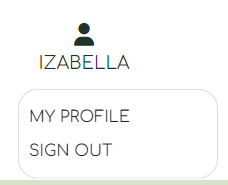
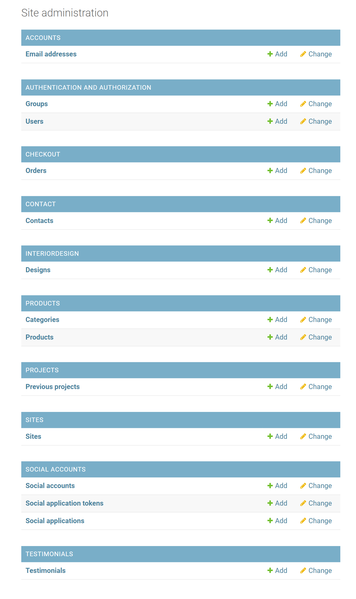

# Decor Dreams | Testing

This document provides an overview of the testing strategies applied throughout the development of the Decor Dreams store. It includes various types of testing to ensure functionality, compatibility, usability, and responsiveness of the application.

[Back to README.md](README.md)

---

## CONTENTS

- [Decor Dreams | Testing](#decor-dreams--testing)
  - [CONTENTS](#contents)
  - [User Story Testing](#user-story-testing)
      - [EPIC - Viewing and Navigation](#epic---viewing-and-navigation)
      - [EPIC - User Authentication](#epic---user-authentication)
      - [EPIC - Shop Products](#epic---shop-products)
      - [EPIC - Administration and Store Management](#epic---administration-and-store-management)
      - [EPIC - Design \& Planning](#epic---design--planning)
      - [EPIC - Marketing and SEO](#epic---marketing-and-seo)
  - [Site Administration](#site-administration)
  - [Code Validation](#code-validation)
    - [HTML](#html)
    - [CSS](#css)
    - [JavaScript](#javascript)
---

## User Story Testing

#### EPIC - Viewing and Navigation

| User Story                                                                                                                                                                     | Screenshot                                                               |
|--------------------------------------------------------------------------------------------------------------------------------------------------------------------------------|--------------------------------------------------------------------------|
| *"As a Site User I want to be able to navigate intuitively around the site so that I can easily find the content I'm interested in."*                                       |           |
| *"As a Site User I want to be able to see a comprehensive list of products available so that I can choose what to explore further."*                                       |           |
| *"As a Shopper I want to be able to click on a product so that I can read the full product details."*                                       |           |
| *"As a Shopper I want to be able to view a specific category of products so that I can find what I like more easily and have a smoother time shopping."*                                       |           |
| *"As a Shopper I want to be able to search for products across the website so that I can easily find what I need."*                                       |       |
| *"As a Shopper I want to be able to arrange all products by price or title so that I can easily compare and view them."*                                       |       |
| *"As a Site User I want to be able to view a comprehensive list of interior design services provided so that I can understand the scope of each service and easily make an enquiry if I'm interested."*                                       |       |
| *"As a Site User I want to be able to access the testimonials left by other customers so that I can gauge the quality of the Interior Design Services they received."*                                       |       |
| *"As a Site User I want to be able to browse through pictures of previous Decor Dreams interior design projects so that I can assess the quality of work and develop trust in the service provider."*                                       |       |

#### EPIC - User Authentication

| User Story                                                                                                                                                                     | Screenshot                                                               |
|--------------------------------------------------------------------------------------------------------------------------------------------------------------------------------|--------------------------------------------------------------------------|
| *"As a Site User I want to be able to sign up so that I can have a personal account on Decor Dreams."*                                       |           |
| *"As a Site User I want to be able to log in or log out of my account so that I can keep my account secure."*                                       |           |
| *"As a Site User I want to be able to check my login status so that I can know if I'm logged in or out."*                                       |          |
| *"As a Site User I want to be able to access my order history so that I can recall my past purchases."*                                       |          |
| *"As a Site User I want to be able to save my personal details in my user profile so that I do not have to fill them out for future orders."*                                       |          |
| *"As a Site User I want to be able to recover my password if I forget it so that I can regain access to my account."*                                       |          |

#### EPIC - Shop Products

| User Story                                                                                                                                                                     | Screenshot                                                               |
|--------------------------------------------------------------------------------------------------------------------------------------------------------------------------------|--------------------------------------------------------------------------|
| *"As a Shopper I want to be able to add multiple products in varying quantities to my shopping bag so that I can purchase them all together when I'm ready."*                                       |           |
| *"As a Shopper I want to be able to see a running total of my shopping bag as I add items so that I can keep track of the total cost."*                                       |          |
| *"As a Shopper I want to be able to view a summary of my shopping cart during checkout so that I can review the included products and the total cost before finalizing my purchase."*                                       |           |
| *"As a Shopper I want to be able to modify the quantity of individual products in my shopping bag so that I can easily make changes before finalizing my purchase."*                                       |           |
| *"As a Shopper I want to be able to securely enter my payment information easily so that I can ensure a quick and hassle-free purchase process for my selected products."*                                       |           |
| *"As a Shopper I want to be able to view the contents of my shopping bag at any time so that I can review what items are included and the total cost."*                                       |           |
| *"As a Shopper I want to be able to checkout as a guest so that I can make a purchase without having to sign up for an account."*                                       |           |
| *"As a Shopper I want to be able to view an order confirmation after completing the checkout process so that I can ensure that my purchase was successful."*                                       |           |
| *"As a Shopper I want to be able to receive an email confirmation of my order so that I can have a record of my purchase."*                                       |          |

#### EPIC - Administration and Store Management

| User Story                                                                                                                                                                     | Screenshot                                                               |
|--------------------------------------------------------------------------------------------------------------------------------------------------------------------------------|--------------------------------------------------------------------------|
| *"As a Store Owner I want to be able to add, edit, and delete products using a user-friendly interface so that I can ensure smooth management of the store's contents."*                                       |            |
| *"As a Store Owner I want to be able to add, edit, and delete interior design services using a simple interface so that I can manage the site's content."*                                       |            |
| *"As a Store Owner I want to be able to add, edit, and delete images and locations of previous Decor Dreams design projects so that I can effectively manage the site's content."*                                       |            |
| *"As a Store Owner I want to be able to view and delete customer enquiries directly on the front-end so that I can manage them without having to access the admin panel."*                                       |            |

#### EPIC - Design & Planning

| User Story                                                                                                                                                                     | Screenshot                                                               |
|--------------------------------------------------------------------------------------------------------------------------------------------------------------------------------|--------------------------------------------------------------------------|
| *"As a Site User I want to be able to submit an enquiry form so that I can contact the site owner."*                                       |          |
| *"As a Site User I want to be able to add, edit, or delete a testimonial related to a consultation I received so that I can provide my feedback."*                                       |            |

#### EPIC - Marketing and SEO

| User Story                                                                                                                                                                     | Screenshot                                                               |
|--------------------------------------------------------------------------------------------------------------------------------------------------------------------------------|--------------------------------------------------------------------------|
| *"As a Site User I want to be able to sign up for the Decor Dreams' newsletter so that I can stay informed about new products and promotions."*                                       |          |
| *"As a Developer I want to be able to create a Facebook marketing promotional page to spotlight the Decor Dreams so that I can attract potential customers to the website."*                                       |          |

[Back to Contents](#contents)

---

## Site Administration

- Admins possess complete access to Create, Read, Update, and Delete (CRUD) functionalities for all products, categories, interior design services, Decor Dreams projects, testimonials, and users within the admin panel.

[Back to Contents](#contents)

---

## Code Validation

### HTML

I've used [HTML W3C Validator](https://validator.w3.org) to validate all of my HTML files.

| Page                           | Screenshot | Notes     |
|--------------------------------|------------|-----------|
| Home                           |   | Pass: No Errors |
| Products                       |   | Pass: No Errors |
| Product Details                |   | Pass: No Errors |
| Add Product                    |         | Pass: No Errors      |
| Edit Product                   |         | Pass: No Errors      |
| Confirm Delete Product         |         | Pass: No Errors |
| Bag                            |   | Pass: No Errors |
| Checkout                       |   | Pass: No Errors |
| Profile                        |         | Pass: No Errors |
| Search                         |         | Pass: No Errors |
| Interior Design Services       |   | Pass: No Errors |
| Add Interior Design Service    |         | Pass: No Errors      |
| Edit Interior Design Service   |         | Pass: No Errors      |
| Delete Interior Design Service |         | Pass: No Errors |
| Decor Dreams Projects          |   | Pass: No Errors |
| Add Interior Design Project    |         | Pass: No Errors      |
| Edit Decor Dreams Projects     |   | Pass: No Errors |
| Delete Interior Design         |         | Pass: No Errors |
| Testimonials                   |   | Pass: No Errors |
| Add Testimonial                |         | Pass: No Errors |
| Edit Testimonial               |         | Pass: No Errors |
| Delete Testimonial             |         | Pass: No Errors |
| Contact                        |   | Pass: No Errors |
| Consultation Dashboard         |         | Pass: No Errors |
| Consultation Detail            |         | Pass: No Errors |
| Delete Consultation            |         | Pass: No Errors |
| Sign In                        |   | Pass: No Errors |
| Sign Up                        |   | Pass: No Errors |
| Log Out                        |         | Pass: No Errors |
| Password Reset                 |   | Pass: No Errors |

### CSS

No errors were found when passing my CSS files through the official [W3C CSS Validator](https://jigsaw.w3.org/css-validator/#validate_by_input)

| Page                           | Screenshot | Notes     |
|--------------------------------|------------|-----------|
| *base.css*                     |   | Pass: No Errors |
| *checkout.css*                 |   | Pass: No Errors |
| *profile.css*                  |   | Pass: No Errors |

### JavaScript

All Javascript was passed through [JSHint](https://jshint.com/) with no issues.

| File                           | Screenshot | Notes     |
|--------------------------------|------------|-----------|
| *base*                     |   | Pass: No Errors |
| *main nav*                     |   | Pass: No Errors |
| *products*                     |   | Pass: No Errors |
| *bag*                     |   | Pass: No Errors |
| *stripe elements*                     |   | Pass: No Errors |
| *image selector*                     |   | Pass: No Errors |
| *profile*                     |   | Pass: No Errors |